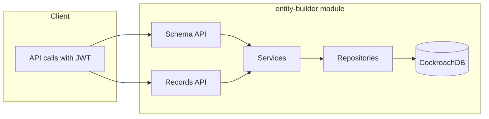

# Plan: Build Dynamic Entity Builder Backend

## Scope and decisions from the spec

**In scope (this plan):**

- New backend module for **entity definitions** (entities, fields, relationships)
- **Tenant extensions** (tenant-specific field overrides/extensions)
- **Record storage** for dynamic entities (`entity_records`, `record_links`)
- **PII handling** via `pii_vault` and security constraints
- **Form layout metadata** (JSON layouts per entity/tenant; no UI)
- **REST API** with OpenAPI + machine-readable AI guide; same error/pagination conventions as IAM
- **Security** via existing IAM (JWT validation, `tenant_id`, permissions)

**Out of scope (per spec):**

- UI (any frontend or form builder UI)
- Reporting / ClickHouse (propose as Phase 2: events or batch sync to ClickHouse; not in this plan)

**Proposed answers to spec questions:**

- **Actual data saving:** Same module, same service deployable. Two clear API surfaces: (1) **Schema API** – entities, fields, relationships, extensions, form layouts; (2) **Records API** – CRUD for `entity_records` and `record_links`. Same database, shared tenant/security.
- **Dynamic form builder:** In this module as **form layout metadata** only (e.g. `form_layouts` table: tenant_id, entity_id, layout JSON). No form renderer or UI here.
- **Reporting / ClickHouse:** Defer. Later: CDC or batch job to push `entity_records` (or aggregates) to ClickHouse; define events or interfaces in a follow-up design.

---

## Tech stack (align with IAM)

- **Language:** Java 17
- **Framework:** Spring Boot 3.4.4
- **Database:** CockroachDB (PostgreSQL-compatible); same as IAM
- **Build:** Gradle; new subproject under root
- **Auth:** JWT from IAM (shared secret/issuer/audience); validate in this service
- **API docs:** Springdoc OpenAPI 2.8.x + `/v1/ai/guide` JSON
- **Migrations:** Flyway
- **Layers:** Controller → Service → Repository; DTOs for API, domain entities for persistence

---

## Architecture

- **Style:** One new **microservice** module `entity-builder` (or `dynamic-entities`), runnable standalone. Communicates with IAM only via JWT (no direct HTTP calls to IAM in v1).
- **Layers:** Controllers (REST), services (transactional, validation), repositories (JPA), domain entities. Global `@RestControllerAdvice` for error envelope.
- **Patterns:** Tenant context from JWT in every request; permission checks via `@PreAuthorize` and optional custom `TenantPrincipal`-style holder; PII never in logs, encrypted at rest in `pii_vault`.
- **Communication:** REST only (no gRPC/events in v1).

---

## Data model (core entities)

- **entities** – id (UUID), tenant_id (UUID), name, slug, description, base_entity_id (nullable; for tenant extensions), created_at, updated_at. Unique (tenant_id, slug).
- **entity_fields** – id, entity_id, name, slug, field_type (e.g. string, number, date, boolean, reference), required (bool), config (JSONB for validations, options). Unique (entity_id, slug).
- **entity_relationships** – id, tenant_id, from_entity_id, to_entity_id, from_field_slug, to_field_slug, name, cardinality (one-to-one, one-to-many, many-to-many). Ensures from/to entities belong to tenant or are base.
- **tenant_entity_extensions** – id, tenant_id, base_entity_id, name, slug; plus child **tenant_entity_extension_fields** for extra fields. Allows tenants to extend a shared “base” entity.
- **entity_records** – id, tenant_id, entity_id, external_id (optional), created_at, updated_at, created_by (user_id). Actual “row” for an entity instance.
- **entity_record_values** – record_id, field_id (or field slug), value_text, value_number, value_date, value_boolean, value_reference (UUID). One row per record+field; type of value column used by field_type.
- **record_links** – id, tenant_id, from_record_id, to_record_id, relationship_id, created_at. Stores relationship instances between records.
- **pii_vault** – id, tenant_id, record_id, field_id, encrypted_value, key_id (for key rotation), created_at. PII stored here; entity_record_values for that field hold a placeholder or reference.
- **form_layouts** – id, tenant_id, entity_id, name, layout (JSONB), is_default (bool), created_at, updated_at. Layout metadata only (sections, controls, bindings to field slugs).

All tenant-scoped tables use `tenant_id`; enforce in service layer that JWT `tenant_id` matches.

---

## API design (v1)

**Schema API (under `/v1/entities`, `/v1/entities/{entityId}/fields`, etc.):**

- List/create/get/update/delete **entities** (tenant-scoped).
- List/create/get/update/delete **entity_fields** per entity.
- List/create/get/delete **entity_relationships** (tenant-scoped).
- List/create/get/update/delete **tenant_entity_extensions** and their fields.
- List/create/get/update/delete **form_layouts** per entity (tenant-scoped).

**Records API (under `/v1/tenants/{tenantId}/entities/{entityId}/records`):**

- List (with pagination, optional filter by field values), create, get, update, delete **entity_records**.
- Get/create/delete **record_links** for a given record or relationship (e.g. `GET /v1/tenants/{tenantId}/records/{recordId}/links`).
- Request/response contract and save flow for data coming from a dynamic UI (or any client) are defined in the **Record save flow** section below.

**PII:**

- No dedicated “PII API” in v1; services detect fields marked as PII and read/write via **pii_vault** (encrypt on write, decrypt on read). API request/response can mask PII (e.g. last 4 chars) using a convention in field config.

**Common:**

- Pagination: `page`, `pageSize`; response shape `{ items, page, pageSize, total }`.
- Error envelope: `{ "error": { "code", "message", "details", "requestId", "path" } }`.
- Auth: `Authorization: Bearer <accessToken>`; tenant from JWT, validated against path `tenantId` where applicable.

---

## Record save flow (dynamic UI / client payload)

This section defines how the backend accepts and persists record data sent by a dynamic UI (or any client): request shape, validation, and step-by-step save logic.

### Request/response contract

**Create record** – `POST /v1/tenants/{tenantId}/entities/{entityId}/records`

- **Request body:**
    - `values` (object, required): map of field slug to value. Example: `{ "values": { "name": "Acme", "status": "active", "amount": 100.50, "dueDate": "2025-12-31", "isActive": true, "ownerId": "uuid-of-record" } }`. Types must align with entity field types (string, number, date, boolean, reference).
    - `links` (array, optional): relationship instances to create for this record. Example: `{ "links": [ { "relationshipSlug": "order-to-customer", "toRecordId": "uuid" } ] }`.
    - `externalId` (string, optional): client-supplied id for idempotency or sync.
- **Idempotency:** Support optional header `Idempotency-Key: <key>`.
    - Backend stores an idempotency entry scoped by `tenant_id + user_id + method + route(path template) + idempotency_key`.
    - Backend computes a `request_hash` from a canonicalized JSON request body:
        - object keys are canonicalized deterministically
        - array order is preserved; for v1, order-sensitivity applies to the `links` array (no re-sorting)
    - Retain idempotency entries for **24 hours**.
    - On retry with the same `Idempotency-Key`:
        - if the stored `request_hash` matches, return the previously stored response (201 for create)
        - if the `request_hash` differs, return **HTTP 409 Conflict**
- `externalId`: optional client-supplied id for deduplication/synchronization.
    - Enforce uniqueness with `(tenant_id, entity_id, externalId)` in `entity_records`.
    - If `Idempotency-Key` is not used and a record already exists for the same `(tenantId, entityId, externalId)`, return the existing record (idempotent create semantics).
- **Response:** 201 with full record representation (id, entityId, tenantId, values, links, created_at, updated_at, created_by). PII fields may be masked in response (e.g. config-driven: last 4 chars, or placeholder).

**Update record** – `PATCH /v1/tenants/{tenantId}/entities/{entityId}/records/{recordId}`

- **Request body:** Same shape as create but all keys optional: `values` (partial map of field slug to value), optional `links` (replace or merge semantics to be decided; recommend replace for links). Only provided fields are updated.
- **Response:** 200 with updated record.

**Get record** – `GET .../records/{recordId}` returns record with values and optionally resolved links; PII masked per permission/field config.

### Validation rules (before persisting)

- **Tenant:** Path `tenantId` must match JWT `tenant_id` (or caller has cross-tenant permission). Entity must belong to tenant (or be base entity for that tenant).
- **Required fields:** For create, every field with `required: true` in `entity_fields` must be present in `values`. For update, required fields are not enforced on partial payload but must remain non-null after merge.
- **Field types:** Coerce/validate each value against `field_type`: string (string), number (number), date (ISO-8601 string or number), boolean (boolean), reference (UUID string). Return 400 with clear message if type fails.
- **References:** For `reference` type, `toRecordId` must exist in `entity_records` and belong to the same tenant; target entity must match the relationship definition if applicable.
- **Links:** Each `relationshipSlug` must resolve to an `entity_relationship` for this tenant. `toRecordId` must be a record of the target entity in the same tenant. Cardinality (e.g. one-to-many) can be enforced when creating links (e.g. reject if would exceed max).

### Step-by-step save logic (create)

1. Parse request body into `values` and optional `links`, and read `externalId`.
2. Compute a canonical `request_hash` from the request JSON body:
- canonicalize object key ordering deterministically
- preserve array ordering; include the order-sensitive `links` array as-is
3. Idempotency decision:
- If `Idempotency-Key` header is present:
    - look up idempotency entry by `tenant_id + user_id + method + route_template + idempotency_key`
    - if found:
        - if stored `request_hash` matches, return the stored response (201)
        - if stored `request_hash` differs, return **409 Conflict**
- Else if `externalId` is present:
    - look up existing record by `(tenant_id, entity_id, externalId)`
    - if found, return the existing record (idempotent create)
4. Load entity and its fields (including tenant extension fields if any) for `entityId` and `tenantId`. If entity not found or not accessible, return 404.
5. **Validate:** Required fields present; each value type matches field_type; reference values are valid record IDs in same tenant; no PII in logs.
6. Start transaction. Insert row into `entity_records` (tenant_id, entity_id, external_id, created_by from JWT); obtain `record_id`.
7. For each (field_slug, value) in `values`: resolve to `field_id`. If field has `config.pii: true`, encrypt value and write to `pii_vault` (tenant_id, record_id, field_id, encrypted_value, key_id); write placeholder or vault reference into `entity_record_values` for that record_id and field_id. Otherwise write value into the appropriate `value_*` column in `entity_record_values` (one row per record_id + field_id).
8. For each item in `links`: resolve `relationshipSlug` to `relationship_id`; validate `toRecordId` exists and is same tenant; insert into `record_links` (tenant_id, from_record_id, to_record_id, relationship_id).
9. Commit transaction. Return 201 with record representation (values resolved from entity_record_values and pii_vault with decryption/masking as needed).

### Step-by-step save logic (update)

1. Load existing record; ensure it belongs to tenant and entity from path. If not found, 404.
2. Parse body (partial `values`, optional `links`). Validate types and references for supplied fields only. Merge `values` with existing: for each key in payload, replace; required fields must remain non-null after merge.
3. In transaction: update `entity_records.updated_at` (and optionally updated_by). For each key in `values`: upsert `entity_record_values` (or pii_vault for PII fields) as in create. If `links` provided with replace semantics: delete existing record_links for this record (and relationship scope), then insert new links as in create.
4. Commit. Return 200 with updated record.

---

## Security and constraints

- **IAM integration:** Validate JWT (same issuer/audience/secret as IAM); extract `tenant_id`, `user_id`, permissions. Require permissions e.g. `entity_builder:schema:read|write`, `entity_builder:records:read|write`, `entity_builder:pii:read|write` (add to IAM permission seed in a coordinated migration or document for IAM admin).
- **Tenant isolation:** Every query filtered by `tenant_id` from JWT; path `tenantId` must match JWT for non-superadmin.
- **PII:** Store only in `pii_vault`; encrypt at rest (e.g. AES); never log PII; optional key_id for rotation. Field metadata marks PII (e.g. `config.pii: true`).
- **Relationships:** Validate that from/to entities and records belong to the same tenant (or allowed base-entity pattern).

---

## Project structure

- **Root:** Add subproject `entity-builder` in [settings.gradle](settings.gradle).
- **entity-builder/** (new module):
    - `build.gradle` (same as IAM: Boot, Web, Security, JPA, Validation, Flyway, springdoc, PostgreSQL driver; no JWT impl dependency if validating with shared library or REST – or use same jjwt if this service validates JWT itself).
    - `src/main/java/com/erp/entitybuilder/`: `EntityBuilderApplication`, `config/`, `domain/`, `repository/`, `service/`, `web/v1/` (controllers), `web/v1/dto/`, `web/ErrorHandlingAdvice`, `security/` (JWT filter, principal).
    - `src/main/resources/application.yml`, `db/migration/V1__...` through Vn for schema.
    - `src/test/` – unit and e2e tests (e.g. Testcontainers or shared Cockroach for e2e).

---

## Implementation steps (ordered)

1. **Module and config** – Add `entity-builder` to [settings.gradle](settings.gradle); create [entity-builder/build.gradle](entity-builder/build.gradle) and Boot main class; `application.yml` with datasource, Flyway, JWT props (issuer, audience, secret); Cockroach dialect.
2. **Security wiring** – JWT validation filter and principal; `SecurityConfig` (permit `/v3/api-docs`, `/swagger-ui/`**, `/v1/ai/guide`; require auth for `/v1/`**); optional `@PreAuthorize` and tenant checks using principal.
3. **Schema: entities and fields** – Flyway migrations for `entities`, `entity_fields`; domain entities and repositories; service + DTOs; REST CRUD for entities and for fields under an entity; pagination and error envelope.
4. **Schema: relationships and tenant extensions** – Migrations for `entity_relationships`, `tenant_entity_extensions`, `tenant_entity_extension_fields`; domain and repos; services; API for relationships and for tenant extensions.
5. **Records and record values** – Migrations for `entity_records`, `entity_record_values`, `record_links`; services implementing the **Record save flow** (request body parsing, validation against entity_fields, create/update steps including PII redirect and link persistence); Records API (list/create/get/update/delete records; get/create/delete links). Optional `Idempotency-Key` on create.
6. **PII vault** – Migration for `pii_vault`; encryption at rest (e.g. AES with key from config/env); service layer to redirect PII field writes to vault and reads from vault; no PII in logs.
7. **Form layouts** – Migration for `form_layouts`; CRUD API (tenant + entity scoped); store/return layout JSON only.
8. **OpenAPI and AI guide** – Springdoc dependency and config; `GET /v1/ai/guide` with workflows, auth, and links to OpenAPI; consistent operationIds and examples.
9. **Tests** – Unit tests for services (tenant isolation, validation); e2e tests for Schema and Records APIs with JWT (and optionally shared DB or Testcontainers).
10. **Documentation** – README for entity-builder (config, API overview, permission requirements, how to run); update root README if needed.

---

## Testing strategy

- **Unit:** Service layer: tenant isolation, validation (e.g. duplicate slug, invalid relationship), PII encrypt/decrypt.
- **Integration/e2e:** REST with valid JWT: create entity → add fields → create record → add link; 403 without permission or wrong tenant; OpenAPI and `/v1/ai/guide` reachable.
- **Edge cases:** Extension of base entity; relationship cardinality; record_links consistency; PII not in response when not allowed.

---

## Expected deliverables

- New runnable module `entity-builder` with full Schema + Records API and form layouts.
- Database schema (Flyway) for entities, fields, relationships, extensions, records, record_values, record_links, pii_vault, form_layouts.
- OpenAPI at `/v3/api-docs`, Swagger UI, and `GET /v1/ai/guide` with stable schemas and workflows.
- README and (if needed) IAM permission seeds or doc for `entity_builder:`* permissions.
- No UI; reporting/ClickHouse left for a later phase.

