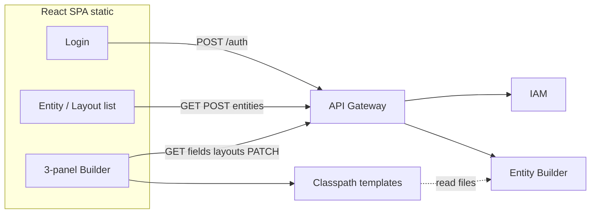

# Entity & Form Builder UI — design

> **Source of truth:** In-repo copy for version control. Updated with **build decisions (locked)** below.

## Build decisions (locked)

| Topic | Decision |
| ----- | ---------- |
| **Milestone** | **v1 = admin builder only** — no end-user runtime (no record entry app) in this pass. |
| **Layout structure** | **Regions from day one:** `header`, `detail`, and **tabs** (tab group + tab panels). |
| **Template library** | **Classpath JSON only** — no DB catalog table for v1; entity-builder loads `classpath:form-layout-library/**`. |
| **Frontend** | **React + TypeScript**, static SPA. |
| **URLs** | **Honor deep links** — `BrowserRouter` (or equivalent) + server/deploy **fallback to `index.html`** for non-file routes. |
| **API entry** | Browser talks **only to API gateway** (e.g. port 8000); gateway routes to IAM + entity-builder ([`api-gateway/application.yml`](../api-gateway/src/main/resources/application.yml)). |
| **Auth tokens** | **Access token:** hold **in memory** only (React state/module closure). **Refresh:** **`httpOnly` + `Secure` + `SameSite` cookie** (`erp_refresh`); SPA does **not** read refresh from JS. IAM defaults to cookie mode; gateway forwards `Set-Cookie`. |
| **Entities / fields API** | Add **`GET /v1/entities`** (list) and **`GET /v1/entities/{entityId}/fields`**. |
| **Layouts per entity** | **Many named layouts**; **at most one `isDefault: true`** per entity (enforce in `FormLayoutService` + DB constraint if feasible). |
| **Accessibility** | **Keyboard-first**; **no dependency on drag-and-drop** — provide **Add to region / Move up / Move down** (and similar) for all structure edits. Optional DnD later as enhancement. |

## Implementation checklist

- [x] **Gateway:** ensure routes for new paths (e.g. `/v1/form-layout-templates**` if not nested under `/v1/entities/**`).
- [x] **Auth:** access in memory + refresh in `httpOnly` cookie via gateway/IAM contract; `POST /auth/refresh` with credentials (`fetch(..., { credentials: 'include' })`).
- [x] **Backend:** `GET /v1/entities`, `GET /v1/entities/{entityId}/fields`.
- [x] **Backend:** classpath template listing + `POST /v1/entities/{entityId}/form-layouts/from-template` (copy JSON → new `FormLayout`).
- [x] **Backend:** validate layout JSON (regions v2); enforce **one `isDefault`** per entity (`FormLayoutJsonValidator` for `version: 2`; partial unique index + `FormLayoutService` for default).
- [x] **SPA:** React + TS, router deep links, gateway base URL env.
- [x] **Builder UI:** three-panel shell; **keyboard / non-DnD** structure editing; template picker + orphan resolution on clone.
- [x] **SPA:** create entity (`POST /v1/entities`) from [`EntitiesPage`](../erp-portal/src/pages/EntitiesPage.tsx); navigate to layouts.
- [x] **SPA:** entity settings modal (`PATCH /v1/entities/{id}`) — name, slug, description, default display field — from [`EntityLayoutsPage`](../erp-portal/src/pages/EntityLayoutsPage.tsx).
- [x] **SPA:** edit field (`PATCH /v1/entities/{entityId}/fields/{fieldId}`) from data dictionary; field type read-only after create.
- [x] **SPA:** `entity_builder:schema:write` gating via JWT `permissions` claim ([`jwtPermissions`](../erp-portal/src/auth/jwtPermissions.ts)); read-only users can browse layouts without mutating.

## Entity & field lifecycle (portal)

| Route / UI | API |
| ---------- | --- |
| `/entities` — **New entity**, empty-state CTA | `POST /v1/entities` |
| `/entities/:entityId/layouts` — **Entity settings** | `PATCH /v1/entities/{entityId}` (optional `clearDefaultDisplayField` when clearing default display field) |
| Builder left rail — **+ New field** | `POST .../fields` (existing) |
| Builder left rail — **Edit** per field | `PATCH .../fields/{fieldId}` |
| Builder — **Save**, structure/properties edits, **Start from template**, new layout buttons | Gated when JWT lacks `entity_builder:schema:write` |

## Goals

- **Login** via gateway → IAM (`POST /auth/login` with `tenantSlugOrId`, `email`, `password`); access token in memory; refresh cookie set by server.
- **Left — Data dictionary:** all **schema fields** for the current entity. **“Create new database field”** → `POST /v1/entities/{entityId}/fields` ([`EntityFieldsController`](../entity-builder/src/main/java/com/erp/entitybuilder/web/v1/EntityFieldsController.java)). **Edit** → `PATCH .../fields/{fieldId}` (name, slug, required, PII, `config.isSearchable`; type fixed after create). New fields appear in the list; they are **not** on the form until placed via **Add to region** (or similar).
- **Center — Form builder:** edit **regions** (header / tabs / detail) and their **rows** → `columns` → **items**; persist with `PATCH /v1/entities/{entityId}/form-layouts/{layoutId}` ([`FormLayoutsController`](../entity-builder/src/main/java/com/erp/entitybuilder/web/v1/FormLayoutsController.java)).
- **Right — Properties:** when an item is selected, edit **presentation** only (label, placeholder, help, read-only, hidden, width, component hint).

## Information architecture & routing

- **Login** (`/login`) → redirect to **entity list** (`/entities`) or last route.
- **Builder** (`/entities/:entityId/layouts/:layoutId`) — three-column shell; top bar: entity, layout name, **Start from template**, **Save**, optional environment badge.
- **Permissions:** `entity_builder:schema:read|write` in JWT ([`entity-builder/README.md`](../entity-builder/README.md)).

## Backend alignment

| Capability | Today | v1 need |
| ---------- | ----- | ------- |
| List entities | `GET /v1/entities` (full list; pagination later if needed) | Done |
| List fields | `GET /v1/entities/{entityId}/fields` | Done |
| Templates | Classpath `form-layout-library/` + index | `GET /v1/form-layout-templates`, `POST .../form-layouts/from-template` |
| Default layout | Partial unique index + service | Single `is_default` per `(tenant_id, entity_id)` |

## Form layout library (templates) — classpath only (v1)

- **Location:** e.g. `entity-builder/src/main/resources/form-layout-library/` with `index.json` (metadata: `templateKey`, `title`, `description`, `tags`) plus one JSON file per template (or inline layout in index).
- **`GET /v1/form-layout-templates`** — reads classpath; returns metadata (not necessarily full layout unless preview needs it — can add `?includeLayout=true`).
- **`POST /v1/entities/{entityId}/form-layouts/from-template`** — body `{ "templateKey", "name", "isDefault" }` — server loads template JSON, maps slugs → `fieldId` where possible, persists new `FormLayout`.
- **Copy-once** after clone; no subscription to template updates in v1.

## Layout JSON model — **v2 regions** (frontend + backend contract)

Top level uses **`regions`**. Each region has **`role`**: `header` | `detail` | `tab`. Tabs share a **`tabGroupId`**. Rows/columns/items mirror the previous flat model **inside** each region.

```json
{
  "version": 2,
  "regions": [
    {
      "id": "reg-header",
      "role": "header",
      "title": "Summary",
      "tabGroupId": null,
      "rows": [
        {
          "id": "row-1",
          "columns": [
            {
              "id": "col-1",
              "span": 12,
              "items": [
                {
                  "id": "item-1",
                  "fieldId": "uuid",
                  "fieldSlug": "order_number",
                  "presentation": {
                    "label": null,
                    "placeholder": "",
                    "helpText": "",
                    "readOnly": false,
                    "hidden": false,
                    "width": "full",
                    "componentHint": "default"
                  }
                }
              ]
            }
          ]
        }
      ]
    },
    {
      "id": "reg-tab-main",
      "role": "tab",
      "title": "General",
      "tabGroupId": "order-tabs",
      "rows": []
    },
    {
      "id": "reg-detail-lines",
      "role": "detail",
      "title": "Line items",
      "tabGroupId": null,
      "binding": {
        "kind": "entity_relationship",
        "relationshipId": "uuid"
      },
      "rows": []
    }
  ]
}
```

- **Detail `binding`:** optional in v1 UI (can show placeholder until relationship picker exists).
- **Uniqueness:** at most one **item** per `fieldId` per layout unless product explicitly allows repeats.
- **Removing** an item does **not** delete `EntityField`.

## Left sidebar — UX

- Search/filter fields; show **on form / not on form** (derive from layout walk).
- **Create new database field** modal; **Edit** on each row → PATCH field (schema write only).

## Center — structure editor (keyboard / non-DnD)

- **Region list:** add/remove/reorder regions (where allowed); configure tab group + tab order.
- **Within region:** add row, split columns, **Add field** opens picker (focus-driven): choose field from dictionary → insert into focused row/column.
- **Reorder:** **Move up / Move down** for rows, columns, items; visible focus rings; **Delete** with confirmation for non-empty sections.
- **Optional later:** pointer drag-and-drop as a progressive enhancement (not required for v1).

## Right sidebar — properties

- Same as before: presentation + read-only binding + remove from form.

## Login screen

- Validate tenant, email, password client-side; show IAM errors.
- After success: store **access token in memory** only; rely on **cookie** for refresh; all API calls `credentials: 'include'` when using cookies.

## API client

- **Base URL:** gateway origin (env e.g. `VITE_API_BASE_URL=http://localhost:8000`).
- **401 handling:** call `POST /auth/refresh` with cookie, retry once; if refresh fails → clear memory token → redirect `/login`.

## Mermaid — screen flow



## Runtime record entry (portal)

The SPA includes a **minimal** data-entry runtime (list → form) alongside the admin builder.

| Route | Purpose |
| ----- | ------- |
| `/entities/:entityId/records` | Paginated record list; **display** column uses `defaultDisplayFieldSlug` when set. |
| `/entities/:entityId/records/new` | Create record using the entity’s **default** form layout (`isDefault: true`). |
| `/entities/:entityId/records/:recordId` | Edit record (same default layout). |

**APIs (via gateway):**

- Records: `GET/POST/PATCH/DELETE` under `/v1/tenants/{tenantId}/entities/{entityId}/records` (tenant id from JWT `tenant_id`).
- Schema: `GET /v1/entities/{entityId}`, `.../fields`, `.../form-layouts` for layout + field types.

**Permissions (JWT `permissions`, UI hints only):**

- `entity_builder:records:read` — list and open form.
- `entity_builder:records:write` — add, save, delete.
- `entity_builder:pii:read` — show editable PII field values; without it, PII inputs are locked.

**Multi-step (wizard):** optional on layout v2 JSON, validated in `FormLayoutJsonValidator`:

```json
"runtime": {
  "recordEntry": {
    "flow": "wizard",
    "wizard": { "stepOrderRegionIds": ["reg-header", "reg-tab-main"] }
  }
}
```

Each id must match a region `id`. The portal shows **Next / Back** and **Save** on the last step only. With `"flow": "free"` (or omitted `runtime`), all regions render with **tab groups** merged by `tabGroupId` as in the builder model.

**Not implemented yet in runtime:** relationship-bound **detail** grids, reference pickers, and builder UI toggles for `runtime` (edit via layout JSON or API).

**Create UI wizard:** register list/form/wizard screens and IAM nav entries from [`/ui/create`](../erp-portal/src/pages/CreateUiWizardPage.tsx); see [`design/Portal_UI_Wizard.md`](Portal_UI_Wizard.md).

## Out of scope (v1 builder / product)

- DB-backed template catalog.
- Full theming / i18n beyond stored strings.
- **`reference` field type** in create/edit field modals (needs validated `config` contract, e.g. target entity).
