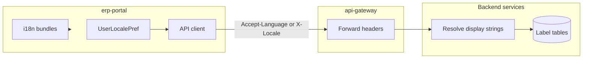

# Plan: Internationalization (i18n)

## Current baseline

- **Portal:** React 19 + Vite + Mantine (`[erp-portal/package.json](erp-portal/package.json)`); no i18n library; hardcoded English.
- **API errors:** `[entity-builder/.../ApiException.java](entity-builder/src/main/java/com/erp/entitybuilder/web/ApiException.java)` already carries a stable `code` plus a string `message`; `[ErrorHandlingAdvice](entity-builder/src/main/java/com/erp/entitybuilder/web/ErrorHandlingAdvice.java)` returns `code`, `message`, and `details` (good foundation for client- or server-side translation).
- **Dynamic metadata:** `[EntityField](entity-builder/src/main/java/com/erp/entitybuilder/domain/EntityField.java)` uses `name` + optional `labelOverride` (single locale). `[TenantEntityExtensionField](entity-builder/src/main/java/com/erp/entitybuilder/domain/TenantEntityExtensionField.java)` is parallel. **Status labels:** table `entity_status_label` + JPA entity exist (`[V18](entity-builder/src/main/resources/db/migration/V18__entity_status_and_record_scope.sql)`, `[EntityStatusLabel](entity-builder/src/main/java/com/erp/entitybuilder/domain/EntityStatusLabel.java)`) but label rows are **not yet** surfaced through a clear read path in application services (grep shows domain/repo only).
- **IAM / preferences:** No `locale` on `[Tenant](iam/src/main/java/com/erp/iam/domain/Tenant.java)` or `[TenantUser](iam/src/main/java/com/erp/iam/domain/TenantUser.java)`; `[PortalNavigationItem](iam/src/main/java/com/erp/iam/domain/PortalNavigationItem.java)` has a single `label`.
- **Gateway:** Spring Cloud Gateway routes in `[api-gateway/.../application.yml](api-gateway/src/main/resources/application.yml)`; **verify** proxied requests preserve `Accept-Language` (default is usually to forward; avoid stripping in filters).

## Architecture (locale resolution)

**Recommended resolution order** (document and implement consistently): explicit header/query from portal **> user preference** (once stored) **> tenant default locale** (once stored) **> Accept-Language** **> fallback** (e.g. `en`).

---

## Phase 1 — Portal static UI + locale propagation

- Add `**react-i18next**` (fits React 19 / Vite; alternative: Lingui) with namespace(s) under e.g. `erp-portal/src/locales/{en,es}/...json`.
- **Bootstrap:** `i18n.init` with `fallbackLng`, detection order: stored preference (e.g. `localStorage`) then `navigator.language`.
- **UI:** Language switcher in shell layout; use `t('...')` for high-traffic surfaces first (nav shell, auth/errors, builder chrome), then expand incrementally.
- **API client:** Configure shared `fetch`/axios wrapper to send `**Accept-Language**` (and optionally `**X-User-Locale**` if you want an explicit override) on all calls to the gateway. Ensures backends can resolve metadata without extra query params everywhere.
- **Gateway:** Confirm no custom filter removes `Accept-Language`; add integration test or manual checklist.

## Phase 2 — Entity-builder: multilingual **display labels** (fields + extensions)

**Principle:** Keep `**slug`** non-localized; localize **human-facing labels** only.

- **Schema:** New table `entity_field_label` (mirror `entity_status_label`): `(entity_field_id, locale, label)` with `UNIQUE (entity_field_id, locale)`; tenant/scoping consistent with `[entity_fields](entity-builder/src/main/resources/db/migration/V1__create_dynamic_entities.sql)` ownership (likely `tenant_id` if you multi-tenant isolate labels, or inherit via join to entity—match existing `EntityStatusLabel` pattern).
- **Parallel table** (or same pattern with `extension_field_id`) for `**tenant_entity_extension_fields`** if those are user-visible in the same way.
- **API / DTOs:** Extend `[EntityFieldDtos.EntityFieldDto](entity-builder/src/main/java/com/erp/entitybuilder/web/v1/dto/EntityFieldDtos.java)`:
  - `**labels**` — `Map<String, String>` or list of `{ locale, label }` for admin/designer UIs.
  - `**displayLabel**` — single string resolved server-side from request locale + fallback (`labelOverride` / legacy `name` if no row).
- **Write path:** CRUD sub-resource e.g. `PUT /v1/tenants/{tid}/entities/{eid}/fields/{fid}/labels/{locale}` or batch on field update—pick one style and use for extensions too.
- **Migration:** Treat existing `labelOverride` as seed for `default` or `en` locale once; then deprecate or keep as backward-compat fallback.
- **Portal:** `[LayoutV2RuntimeRenderer.tsx](erp-portal/src/components/runtime/LayoutV2RuntimeRenderer.tsx)` / `[ReferenceRecordLookupField.tsx](erp-portal/src/components/runtime/ReferenceRecordLookupField.tsx)` should prefer `**displayLabel**` from API when present; builder modals edit **per-locale** labels.
- **Tests:** E2E in `[entity-builder/.../e2e](entity-builder/src/test/java/com/erp/entitybuilder/e2e)` for create label + GET field resolves correct `displayLabel` given `Accept-Language`.

## Phase 3 — Entity status labels (wire existing model)

- Implement services + controllers (or extend existing status endpoints) to **read/write** `[EntityStatusLabel](entity-builder/src/main/java/com/erp/entitybuilder/domain/EntityStatusLabel.java)` rows.
- **Record/API responses:** Where status is shown, resolve label for requested locale (same fallback rules as fields).
- Align with `[EntityStatusProvisionController](entity-builder/src/main/java/com/erp/entitybuilder/web/v1/EntityStatusProvisionController.java)` / provisioning so default catalog seeds include at least one locale (e.g. `en`).

## Phase 4 — User / tenant locale + optional server message catalog

- **IAM:** Add `preferred_locale` on user or `tenant_users` (BCP 47, max ~16 chars); optional `default_locale` on `tenants`. Expose via existing bootstrap/me endpoints consumed by portal; portal sets API headers from this after login.
- **Server translations (optional):** Spring `MessageSource` + `messages_{locale}.properties` in each service; in `ErrorHandlingAdvice`, map `code` + locale to translated `message` while keeping `code` stable. Start with entity-builder only, then replicate pattern to IAM/core-service.

## Phase 5 — Broader product surfaces (as needed)

- **Portal navigation:** `[PortalNavigationItem](iam/src/main/java/com/erp/iam/domain/PortalNavigationItem.java)` today has one `label`; introduce `portal_navigation_item_label` or JSONB map—larger IAM/portal change.
- **Core master data:** Company/location **names** are business data; often left monolingual or handled as separate “translation” rows—defer unless product requires multilingual org names.

---

## Out of scope / risks (explicit)

- **Legal/regulatory copy** and **email templates** usually need their own workflow; do not block Phase 1–3 on them.
- **Collation / full-text search** across languages may need DB/index changes later; not required for label display.
- **Catalog JSON** (`[system-entity-catalog](entity-builder/src/main/resources/system-entity-catalog)`): can keep English in repo and **override labels per locale in DB** after sync, or add locale-specific files in a later iteration.

