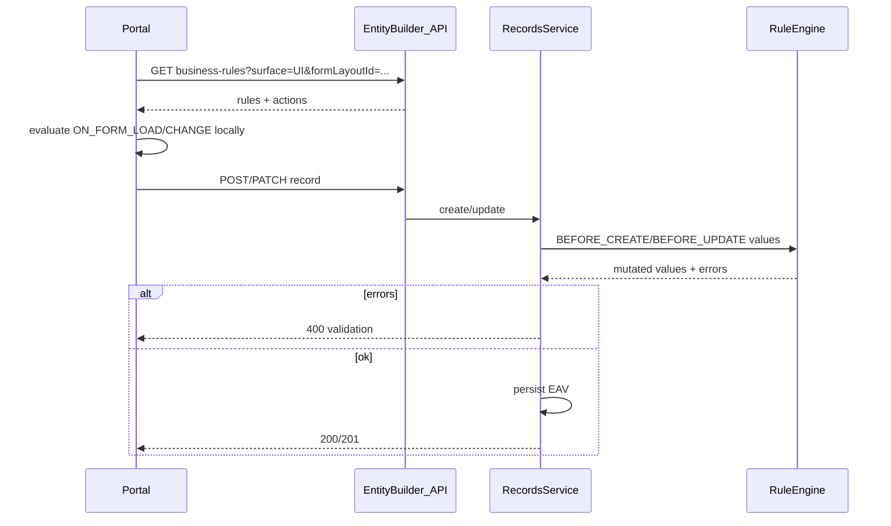

# Business rules (UI + server) — implementation plan

## Scope for v1 (first shippable)

- **In scope:** Declarative JSON conditions (`and` / `or` / `cmp` on field slugs), two **triggers** on the server (`BEFORE_CREATE`, `BEFORE_UPDATE`), two **UI triggers** (`ON_FORM_LOAD`, `ON_FORM_CHANGE` evaluated only in the portal). **Actions:** `SERVER_SET_FIELD_VALUE`, `SERVER_ADD_ERROR` (blocking field/global errors), `UI_SET_FIELD_VISIBILITY`, `UI_SET_FIELD_READ_ONLY`, `UI_SET_FIELD_REQUIRED` (UX hint only; mirror with `SERVER_ADD_ERROR` when data must be enforced).
- **Out of v1:** Jailbreak scripts/webhooks, parent/child hydration/aggregations, normalized condition AST tables, async/webhook actions, expression/formula tier. These can extend the same `action_type` / `payload` enums later without breaking the schema.

## Data model

Add Flyway (next version after [V21](entity-builder/src/main/resources/db/migration/V21__entity_status_assignment_scope.sql)) creating:

- `**business_rule`:** `id`, `tenant_id`, `entity_id` (FK `entities`), optional nullable `form_layout_id` (FK `form_layouts`, for UI-scoped rules), `name`, `description`, `priority` (int), `trigger` (string enum), `condition_json` (JSONB), `is_active`, audit timestamps. Indexes: `(tenant_id, entity_id, trigger, is_active)`, optional `(tenant_id, form_layout_id)`.
- `**business_rule_action`:** `id`, `business_rule_id` (FK cascade), `priority`, `action_type` (string), `payload` (JSONB), `execution_surfaces` (store as string: `UI`, `SERVER`, or `UI,SERVER` / two boolean columns — pick one; recommend `**ui` + `server` booleans** for simple filtering).

**Referencing fields:** Conditions and payloads use **field slugs** (aligned with existing record payloads in [RecordsService.java](entity-builder/src/main/java/com/erp/entitybuilder/service/RecordsService.java)).

**Optional v1.1:** `rule_group_id` (UUID) to tie “same condition, UI trigger + SERVER trigger” rows for admin UX; not required if you accept duplicate `condition_json` copies initially.

## Backend modules

| Piece             | Responsibility                                                                                                                                                                                                                                                                                                                                                                                                                                                                                                                                                                                                                                                                                                                                                                                                                                                                                                         |
| ----------------- | ------------------------------------------------------------------------------------------------------------------------------------------------------------------------------------------------------------------------------------------------------------------------------------------------------------------------------------------------------------------------------------------------------------------------------------------------------------------------------------------------------------------------------------------------------------------------------------------------------------------------------------------------------------------------------------------------------------------------------------------------------------------------------------------------------------------------------------------------------ |
| Domain            | `BusinessRule`, `BusinessRuleAction` entities under [entity-builder/.../domain](entity-builder/src/main/java/com/erp/entitybuilder/domain) matching table names                                                                                                                                                                                                                                                                                                                                                                                                                                                                                                                                                                                                                                                                                                                                                        |
| Repos             | `BusinessRuleRepository` with queries: `findByTenantIdAndEntityIdAndTriggerAndIsActiveTrueOrderByPriorityAsc`, optional layout filter                                                                                                                                                                                                                                                                                                                                                                                                                                                                                                                                                                                                                                                                                                                                                                                  |
| DTOs + controller | `BusinessRuleDtos` + `BusinessRulesController` under `web/v1`: CRUD/list for `tenantId` + `entityId`; query param `surface=UI|SERVER|all` and optional `formLayoutId` for portal fetch                                                                                                                                                                                                                                                                                                                                                                                                                                                                                                                                                                                                                                                                                                                                 |
| Security          | Reuse schema write pattern: `@PreAuthorize` consistent with [FormLayoutsController.java](entity-builder/src/main/java/com/erp/entitybuilder/web/v1/FormLayoutsController.java) / [EntityBuilderSecurity.java](entity-builder/src/main/java/com/erp/entitybuilder/security/EntityBuilderSecurity.java) (`canWriteTenantSchema` / cross-tenant admin as appropriate)                                                                                                                                                                                                                                                                                                                                                                                                                                                                                                                                                     |
| Evaluator         | `RuleConditionEvaluator` — pure function: `(conditionJson, Map<String,Object> values) -> boolean`. `BusinessRuleEngine` — loads rules, filters by `trigger` + surface, sorts by rule `priority` then action `priority`, applies server actions to a **working copy** of values and collects errors                                                                                                                                                                                                                                                                                                                                                                                                                                                                                                                                                                                                                     |
| Persistence hook  | In [RecordsService.java](entity-builder/src/main/java/com/erp/entitybuilder/service/RecordsService.java) `**createRecord`**: after unknown-field / core-domain checks and initial value map is known, build `Map<String,Object>` view of incoming values (and nulls for missing keys if you need “empty” semantics), run `BEFORE_CREATE` rules (SERVER actions only), merge `SERVER_SET_FIELD_VALUE` into the map, then run existing required-field / persistence logic (so defaults set by rules participate in validation). On `**updateRecord**`: same with `BEFORE_UPDATE` using **merged** state (existing DB values for fields not in patch + patch values) so conditions see the post-update intent. If `SERVER_ADD_ERROR` fires → throw `ApiException` BAD_REQUEST like other validation (reuse [ErrorHandlingAdvice](entity-builder/src/main/java/com/erp/entitybuilder/web/ErrorHandlingAdvice.java) shape). |

**Compute-then-commit:** Keep rule evaluation **in-process before** EAV writes; no DB transaction duration increase beyond today’s `@Transactional` methods (rules are in-memory + DB read of rule definitions only — cache rules per request if needed).

## Condition JSON contract (shared)

Document one schema (Markdown under `design/` only if you want it versioned with the product — otherwise Java/TS class comments + test fixtures):

- Boolean nodes: `{ "op": "and" | "or", "children": [ ... ] }`
- Predicate: `{ "op": "cmp", "field": "<slug>", "operator": "eq"|"neq"|"gt"|"gte"|"lt"|"lte"|"isEmpty"|"isNotEmpty", "value": <json> }`

**Alignment:** Add a small set of **golden JSON fixtures** used by both [JUnit](entity-builder/src/test/java/com/erp/entitybuilder) and a **portal unit test** so UI/server semantics cannot drift.

## Portal integration

- **API:** Extend [erp-portal/src/api/client.ts](erp-portal/src/api/client.ts) (or sibling module) with list fetch for rules; types in `api/schemas` or `types/businessRule.ts`.
- **Runtime:** [LayoutV2RuntimeRenderer.tsx](erp-portal/src/components/runtime/LayoutV2RuntimeRenderer.tsx) — add optional prop `uiRules?: BusinessRuleDto[]` (or precomputed `fieldUiState`). A `useMemo` builds, from `values`, a map `slug -> { hidden?, readOnly?, required? }` using the same evaluator as Java (ported to TS). Merge order: static `presentation.hidden` **or** dynamic hidden; required combines schema `field.required` **or** dynamic required hint.
- **Loader:** [RecordFormPage.tsx](erp-portal/src/pages/RecordFormPage.tsx) loads rules when `entityId` / layout is known (same tenant session as today); pass into renderer. Re-evaluate on each `values` change (`ON_FORM_CHANGE`).

## API Gateway

If external traffic goes through the gateway, add route mapping for new paths (mirror existing entity-builder routes in [api-gateway](api-gateway/)) so the portal can call the rules endpoint in deployed envs.

## Testing

- **Java unit tests:** `RuleConditionEvaluatorTest` (operators, nulls, reference fields as UUID/string), `BusinessRuleEngineTest` (ordering, SET_FIELD + ADD_ERROR).
- **E2E:** One [AbstractEntityBuilderE2ETest](entity-builder/src/test/java/com/erp/entitybuilder/e2e/AbstractEntityBuilderE2ETest.java)-style flow: seed rule via API, create/update record, expect 400 vs success; optional portal E2E later.

## Rollout / safety

- Feature is **opt-in per entity**: no rows → no behavior change.
- **SERVER_ADD_ERROR** is authoritative; **UI_*** actions are never trusted for security.
- Log rule execution failures with `ruleId` in structured logs for observability (v1 light).

