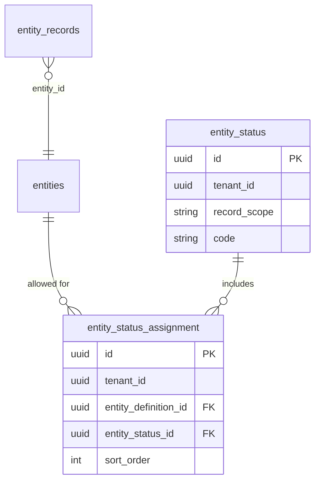

# Entity status catalog + per-entity assignments

## Goals

- **Single global catalog** in `[entity_status](entity-builder/src/main/resources/db/migration/V18__entity_status_and_record_scope.sql)`: each row is a status code (ACTIVE, INACTIVE, WIP, DELETED, …) keyed by `(tenant_id, code)` for the owning row (platform vs tenant), with **no** `entity_definition_id` on `entity_status`.
- **Per–entity-definition usage** via new table `**entity_status_assignment`**: which `entity_status.id` values are allowed when editing/listing records for entity **E** (e.g. Address).
- **Remove** `entity_definition_id` from `**entity_status` only** (your request). Leave `[EntityStatusTransition.entity_definition_id](entity-builder/src/main/java/com/erp/entitybuilder/domain/EntityStatusTransition.java)` as-is for now (provisioner already sets it `null`); optional later Flyway to drop it if you want a fully normalized model.
- **UI/UX**: Reference fields targeting `entity_status` should only offer **assigned** statuses (with a pragmatic fallback). Record **list** page should allow filtering by that reference (status) field.

## 1. Database (Flyway `V20__entity_status_assignment.sql`)

- `**entity_status_assignment**`: `id`, `tenant_id` (tenant **configuring** the assignment), `entity_definition_id` → `entities(id)` `ON DELETE CASCADE`, `entity_status_id` → `entity_status(id)` `ON DELETE CASCADE`, `sort_order` (default 0), `created_at` / `updated_at`. **Unique** `(tenant_id, entity_definition_id, entity_status_id)`.
- `**entity_status` cleanup**:
  - Drop partial unique indexes `entity_status_tenant_def_code_uq` and `entity_status_tenant_null_def_code_uq` and index `idx_entity_status_entity_definition_id`.
  - Drop column `entity_definition_id`.
  - Add `**UNIQUE (tenant_id, code)`** on `entity_status` (adjust if you need composite uniqueness with `record_scope`; if collisions are possible between `STANDARD_RECORD` and `TENANT_RECORD` on same tenant+code, use `UNIQUE (tenant_id, record_scope, code)` instead — for current usage, tenant-owned rows are `TENANT_RECORD` on customer tenants and `STANDARD_RECORD` on platform tenant, so `(tenant_id, code)` is usually sufficient).

Data migration: existing rows all have `entity_definition_id IS NULL`; dropping the column is straightforward.

## 2. Backend domain and services

- **JPA**: `EntityStatusAssignment` entity + `EntityStatusAssignmentRepository` (find by tenant + entity definition, delete by id, etc.).
- **Remove** `entityDefinitionId` from `[EntityStatus](entity-builder/src/main/java/com/erp/entitybuilder/domain/EntityStatus.java)` and drop unused `[EntityStatusRepository.findByTenantIdAndEntityDefinitionIdAndRecordScope](entity-builder/src/main/java/com/erp/entitybuilder/repository/EntityStatusRepository.java)`.
- `**EntityStatusAssignmentService`** (new):
  - `listAssignments(requestTenantId, entityDefinitionId)` → ordered rows with resolved status **code/label** (and `entityStatusId`) for portal/API.
  - `replaceAssignments`/`upsert`/`delete` with auth: same pattern as schema mutation — tenant must own `entity_definition_id`, plus `[EntityBuilderSecurity](entity-builder/src/main/java/com/erp/entitybuilder/security/EntityBuilderSecurity.java)` checks; validating each `entity_status_id` is **readable** to the requester (reuse visibility rules similar to `[EntityStatusLabelService.assertCanReadStatus](entity-builder/src/main/java/com/erp/entitybuilder/service/EntityStatusLabelService.java)`).
- `**EntityStatusDynamicEntityProvisioner`**: remove all `setEntityDefinitionId` on `[EntityStatus](entity-builder/src/main/java/com/erp/entitybuilder/domain/EntityStatus.java)` / transitions (already null). **Extend seeds** with additional global codes (e.g. **WIP**) and mirror rows + transitions as needed (`[EntityStatusDynamicEntityProvisioner.seedStatus](entity-builder/src/main/java/com/erp/entitybuilder/service/catalog/EntityStatusDynamicEntityProvisioner.java)`).

## 3. Assignment REST API

Under existing gateway route `[/v1/tenants/*/entities/**](api-gateway/src/main/resources/application.yml)` (no gateway change if paths nest there).

- `GET /v1/tenants/{tenantId}/entities/{entityDefinitionId}/entity-status-assignments` — read for builders / portal (schema read + tenant check).
- `PUT` (replace full set) or `POST`/`DELETE` — pick one style; **PUT with body `entityStatusIds[]` + optional order** keeps semantics simple.

DTOs in a small `EntityStatusAssignmentDtos` record class.

## 4. Filtered record list + lookup (backend)

Today, `[ReferenceRecordLookupField](erp-portal/src/components/runtime/ReferenceRecordLookupField.tsx)` **dropdown mode** loads up to **200** rows via `[listRecords](erp-portal/src/api/schemas.ts)`; **modal** search uses `[lookupRecords](entity-builder/src/main/java/com/erp/entitybuilder/service/RecordsService.java)` (~lines 612–679) with `[EntityRecordRepository.findIdsForSearchLookupVisible](entity-builder/src/main/java/com/erp/entitybuilder/repository/EntityRecordRepository.java)`.

**Add optional query parameter** on:

- `GET .../entities/{entityId}/records` → `assignedForEntityId` (UUID, optional)
- `GET .../entities/{entityId}/records/lookup` → same

**Semantics** (when `entityId` is the `**entity_status` mirror entity**, i.e. listing status **records**):

- Resolve assignment IDs for `(requestTenantId, assignedForEntityId)`.
- **If assignments exist** (`count > 0`): restrict to `entity_records.id IN (...)` in addition to existing visibility predicates.
- **If none configured** (`count == 0`): **no extra filter** (preserve today’s behavior so existing tenants are not blocked).

Implement via new `@Query` variants on `[EntityRecordRepository](entity-builder/src/main/java/com/erp/entitybuilder/repository/EntityRecordRepository.java)` (page + native id search) or a thin JPQL/native fragment with optional `IN :ids` clause — keep pagination and `STANDARD_RECORD` visibility logic aligned with `[findVisibleByEntityId](entity-builder/src/main/java/com/erp/entitybuilder/repository/EntityRecordRepository.java)`.

`[RecordsController](entity-builder/src/main/java/com/erp/entitybuilder/web/v1/RecordsController.java)`: plumb `assignedForEntityId` into `listRecords` / `lookupRecords`.

## 5. Portal — form reference field

- Extend `[RecordFormRuntimeContext](erp-portal/src/components/runtime/RecordFormRuntimeContext.tsx)` with `**hostEntityId`** (the definition id of the record being edited/created).
- `[RecordFormPage](erp-portal/src/pages/RecordFormPage.tsx)`: pass `hostEntityId={entityId}` into the provider.
- `[ReferenceRecordLookupField](erp-portal/src/components/runtime/ReferenceRecordLookupField.tsx)`: when `cfg.targetEntitySlug === 'entity_status'` (compare to slug constant or `[EntityStatusCatalogConstants.SLUG](entity-builder/src/main/java/com/erp/entitybuilder/catalog/EntityStatusCatalogConstants.java)` value `'entity_status'`) **and** `hostEntityId` is set, pass `**assignedForEntityId=hostEntityId`** into `listRecords` and `lookupRecords` (`[schemas.ts](erp-portal/src/api/schemas.ts)` signature update).

## 6. Portal — list page “filter by status”

`[EntityRecordsListPage](erp-portal/src/pages/EntityRecordsListPage.tsx)` currently builds only text search via `[buildRecordSearchFilter](erp-portal/src/utils/recordListSearch.ts)`.

- **Discover** fields on the current entity where `fieldType === 'reference'` and config `targetEntitySlug === 'entity_status'`.
- Add a small **toolbar Select** (one per such field, or one shared if only one): options from `**GET .../entity-status-assignments`** for the **current list entity** (`entityId` route param).
- When a UUID is selected, merge an `**and`** group: existing optional text filter `**and**` `{ op: 'eq', field: <slug>, value: <uuid> }` into the body of `[queryRecords](erp-portal/src/api/schemas.ts)`. Clear selection → remove that clause.
- Optional: sync selection to URL query param (e.g. `status=<uuid>&statusField=<slug>`) for shareable links — nice-to-have.

Reference equality is already supported by `[RecordFilterValidator](entity-builder/src/main/java/com/erp/entitybuilder/service/query/RecordFilterValidator.java)` for normal EAV reference fields.

## 7. Admin UI for assignments (minimal)

Without a full new page, options:

- **A (minimal)**: Expose REST only + use existing entity/API tooling until a dedicated screen exists.
- **B (recommended small scope)**: Section on `[EntityLayoutsPage](erp-portal/src/pages/EntityLayoutsPage.tsx)` or entity settings: multi-select of status codes (loaded via assignments API + list of all readable `entity_status` mirror ids or compact catalog endpoint).

Pick **B** if you want operators to configure without Postman; otherwise **A** for a thinner first cut.

## 8. Tests and docs

- **Integration/E2E**: extend or add tests next to `[EntityStatusProvisionE2ETest](entity-builder/src/test/java/com/erp/entitybuilder/e2e/EntityStatusProvisionE2ETest.java)`: create assignments for a tenant entity → list `entity_status` records with `assignedForEntityId` returns only assigned rows; list Address records with `eq` on status field.
- Update `[design/Entity_status_usage.md](design/Entity_status_usage.md)` to describe assignments, removal of `entity_definition_id`, and portal behavior.

## Implementation order

1. Flyway + JPA + remove `entity_definition_id` from `EntityStatus` and provisioner adjustments + extra seeds (WIP).
2. Assignment service + REST.
3. `EntityRecordRepository` / `RecordsService` / `RecordsController` for `assignedForEntityId`.
4. Portal: context + reference field + list filter + minimal assignment UI.
5. Tests + design doc.

