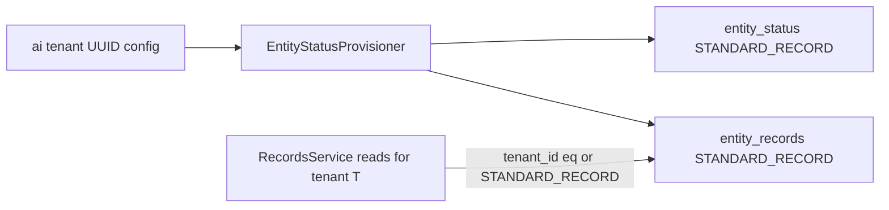

# Entity status schema and dynamic entity seed

## Naming: record scope vs definition scope

- `**DefinitionScope**` (`STANDARD_OBJECT` / `TENANT_OBJECT`) stays **only** on schema objects (`entities`, `entity_relationships`): who owns the **shape**.
- `**RecordScope**` (`STANDARD_RECORD` / `TENANT_RECORD`) on **data** rows (`entity_records`, and analog on `**entity_status`**): **visibility and mutation policy**, not "which tenant_id column to leave null."

`**STANDARD_RECORD` / `TENANT_RECORD`** keeps vocabulary parallel to `**STANDARD_OBJECT` / `TENANT_OBJECT`** without overloading "object" onto records.

## Platform tenant ("ai" tenant)

- `**tenant_id` is never NULL** on `entity_records`, `entity_status`, or related tables.
- All `**STANDARD_RECORD`** rows (canonical statuses, mirrors, transitions' parent scope as applicable) use the **same well-known platform tenant id**—the **"ai" tenant** created in IAM/bootstrap (exact source: config property, env, or shared constant resolved at runtime; document the single wiring point e.g. next to `[BootstrapSeedProperties](iam/src/main/java/com/erp/iam/config/BootstrapSeedProperties.java)` if that already defines platform tenant).
- `**TENANT_RECORD`** rows use the **owning customer tenant's** `tenant_id`.
- **DB**: keep `**tenant_id UUID NOT NULL`**; do not add CHECK constraints that embed the literal ai UUID in Flyway (environment-specific). **Enforce in Java**: on create/update, if `record_scope == STANDARD_RECORD` then require `tenantId.equals(platformAiTenantId)`; if `TENANT_RECORD`, require tenant matches the authenticated tenant context (normal rules).

## Goals

- Persist **decorated status definitions** and **transitions** in PostgreSQL (Cockroach-compatible SQL).
- **Canonical status data** is **visible to all tenants** on **read** (`record_scope = STANDARD_RECORD`), while rows are **stored under the ai tenant id** (no null `tenant_id`).
- **Dynamic model**: provision **EntityDefinition** / **EntityField** / **EntityRelationship** / mirror **EntityRecord** via Java only—**no** `[system-entity-catalog](entity-builder/src/main/resources/system-entity-catalog/)` JSON. The `**entity_status` entity definition** for the platform catalog lives under the **ai tenant** (same as other standard definitions if product already ties catalog to that tenant).
- Add `**entity_records.entity_status_id`** nullable FK → `entity_status(id)` for workflow status (legacy `entity_records.status` VARCHAR unchanged for now).

## 1. Database (Flyway `V18__entity_status.sql`)

### `entity_status` family

- `**entity_status`**: `id`, `**tenant_id` NOT NULL**, `**record_scope` NOT NULL** default `'TENANT_RECORD'`, nullable `**entity_definition_id`** FK → `entities(id)` `ON DELETE CASCADE`, plus attribute columns (`code`, `label`, …) as before.
- **Uniqueness**: e.g. `**UNIQUE (tenant_id, entity_definition_id, code)`** with suitable NULL handling for `entity_definition_id` (partial indexes if needed). Canonical platform rows share **one** `tenant_id` (ai), so the same unique index works.
- `**entity_status_label`**, `**entity_status_transition`**: `**tenant_id` NOT NULL**; carry `**record_scope`** or inherit enforcement from referenced statuses (implementation choice: duplicate columns for simpler filtering, or omit scope on child tables if FK chain guarantees consistency).

### `entity_records`

- Add `**record_scope` VARCHAR(32) NOT NULL DEFAULT `'TENANT_RECORD'`**.
- `**tenant_id` remains NOT NULL** (no migration to nullable).
- `**UNIQUE (tenant_id, entity_id, external_id)`** continues to work: all `STANDARD_RECORD` mirrors share **ai** `tenant_id`.
- Add `**entity_status_id` UUID NULL** REFERENCES `entity_status(id)` `ON DELETE SET NULL` + indexes as needed.

## 2. JPA layer

- `RecordScope` enum; `**EntityRecord`**: `recordScope` + `**tenantId` always required** at persistence level.
- Native `**EntityStatus`** (etc.) with `recordScope` + non-null `tenantId`.
- `**EntityRecord.entity_status_id`** mapping.

## 3. Records API / queries (critical)

- **Reads** for requesting tenant `T`: rows where `**tenant_id = T` OR `record_scope = 'STANDARD_RECORD'`** (and usual `entity_id` / filter predicates). Platform rows carry `tenant_id = ai` but are included for every `T` via scope.
- **Writes**: `**TENANT_RECORD`**: normal tenant APIs, `tenant_id` must match context. `**STANDARD_RECORD`**: only when principal may mutate platform data (`entity_builder:schema:write` or equivalent); `**tenant_id` must be the configured ai tenant id**.
- Reference resolution / list endpoints must apply the **same read visibility** so dropdowns work for all tenants.

## 4. Dynamic entity provisioning (Java only)

`**EntityStatusDynamicEntityProvisioner`** (idempotent):

1. **Resolve platform tenant id** from configuration (ai tenant).
2. **Schema**: `[EntitySchemaService](entity-builder/src/main/java/com/erp/entitybuilder/service/EntitySchemaService.java)` creates/updates `**entity_status`** under `**tenantId = ai`**, `**DefinitionScope.STANDARD_OBJECT**` (aligned with existing catalog pattern for standard entities).
3. **Relationship**: `[RelationshipSchemaService](entity-builder/src/main/java/com/erp/entitybuilder/service/RelationshipSchemaService.java)` with `**STANDARD_OBJECT`** where applicable; relationship rows use `**tenant_id = ai`**.
4. **Seed**: `**ACTIVE` / `INACTIVE` / `DELETED`** as `**STANDARD_RECORD`** with `**tenant_id = ai**` on both `**entity_status**` and mirror `**entity_records**`. **Deterministic UUIDs** may use e.g. `UUID.nameUUIDFromBytes((aiTenantId + "|entity_status|" + code).getBytes(UTF_8))` so ids stay stable per environment.
5. **Source of truth**: native `**entity_status**`; repair EAV mirror from native on re-run.

## 5. Entry point

- `**ensureProvisioned()`** uses **platform tenant id** from config; callable from admin REST or bootstrap after ai tenant exists.

## 6. Tests

- Tenant **A** and **B** both see `**STANDARD_RECORD`** status rows when listing/querying (rows stored under **ai** `tenant_id`).
- Tenant-created rows `**TENANT_RECORD`** with that tenant's `tenant_id`; cannot mutate `**STANDARD_RECORD`** without platform authority.

## 7. Out of scope

- Backfill `**entity_status_id**` on existing business records.

