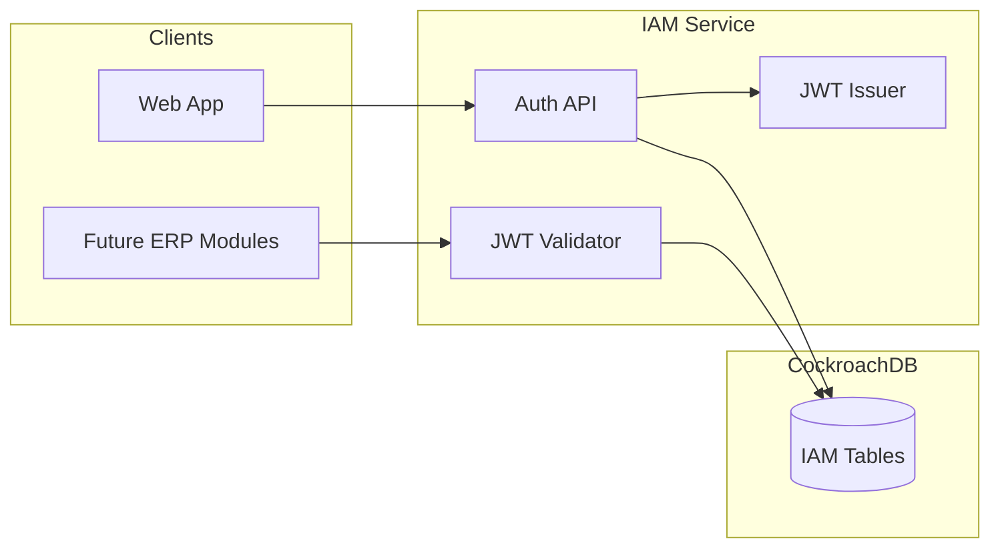

# Identity and Access Management for Multi-Tenant ERP

## Scope and assumptions

- **Stack**: Application layer is unspecified (README implies Node/npm; .idea has Gradle). The plan assumes a **Node/TypeScript** service (e.g. Fastify or Express) for IAM; the **database schema and JWT contract are stack-agnostic** and can be consumed by any future ERP module (Node or Java).
- **Multi-tenancy**: Row-level isolation by `tenant_id`; no separate DB/schema per tenant unless you later adopt that model.
- **CockroachDB**: Use UUID primary keys, consider `tenant_id` in PKs or unique constraints for tenant-scoped uniqueness and efficient partitioning.

---

## 1. High-level architecture




- **IAM service**: Login, refresh, user/role CRUD (tenant-scoped), and JWT issuance.
- **ERP modules**: Validate JWTs (signature + claims), optionally resolve permissions from DB for fine-grained checks.
- **CockroachDB**: Single cluster; all IAM tables include `tenant_id` for isolation.

---

## 2. Database: CockroachDB table design

All tables use `id UUID PRIMARY KEY DEFAULT gen_random_uuid()` and `tenant_id UUID NOT NULL` (except `tenants`). Use `tenant_id` in secondary indexes and unique constraints so tenant-scoped lookups and uniqueness are efficient.

### 2.1 Core tables


| Table                | Purpose                                                                                                                                                               |
| -------------------- | --------------------------------------------------------------------------------------------------------------------------------------------------------------------- |
| **tenants**          | Top-level tenant (organization). `id`, `name`, `slug` (unique), `status`, `created_at`, `updated_at`.                                                                 |
| **users**            | Identity per tenant. `tenant_id`, `email` (unique per tenant), `password_hash`, `display_name`, `status`, `email_verified_at`, `last_login_at`, timestamps.           |
| **roles**            | Role definitions per tenant (e.g. Admin, Finance, Warehouse). `tenant_id`, `name` (unique per tenant), `description`, `is_system` (optional), timestamps.             |
| **permissions**      | Global permission registry (e.g. `invoices:read`, `orders:write`). `code` (unique), `description`, timestamps. Optional `resource`/`action` if you prefer RBAC model. |
| **role_permissions** | Many-to-many: which permissions a role has. `tenant_id`, `role_id`, `permission_id`, unique on `(tenant_id, role_id, permission_id)`.                                 |
| **user_roles**       | User-to-role assignment per tenant. `tenant_id`, `user_id`, `role_id`, unique on `(tenant_id, user_id, role_id)`.                                                     |


### 2.2 Optional but recommended


| Table                                 | Purpose                                                                                                                                                       |
| ------------------------------------- | ------------------------------------------------------------------------------------------------------------------------------------------------------------- |
| **refresh_tokens**                    | Store refresh tokens (jti UUID) per user for revocation and rotation. `tenant_id`, `user_id`, `jti`, `expires_at`, `created_at`. Index on `(tenant_id, jti)`. |
| **audit_log** (or append-only events) | Login, role changes, permission changes. `tenant_id`, `actor_id`, `action`, `resource_type`, `resource_id`, `payload` (JSONB), `created_at`.                  |


### 2.3 CockroachDB-specific choices

- **Primary keys**: `id UUID` for all; for high write throughput on tenant-scoped tables, consider composite PKs like `(tenant_id, id)` and use `CREATE TABLE ... PARTITION BY LIST (tenant_id) (...)` if you introduce partitioning later.
- **Unique constraints**: Always include `tenant_id` where uniqueness is per-tenant (e.g. `UNIQUE (tenant_id, email)` on `users`, `UNIQUE (tenant_id, name)` on `roles`).
- **Indexes**: `(tenant_id)`, `(tenant_id, email)`, `(tenant_id, user_id)` for `user_roles`, `(tenant_id, role_id)` for `role_permissions`, `(tenant_id, jti)` for `refresh_tokens`.
- **Migrations**: Use a migration tool (e.g. **node-pg-migrate**, **Flyway** for Java, or **golang-migrate**) and versioned SQL files under something like `migrations/` or `db/migrations/`.

---

## 3. JWT design for ERP modules

- **Issuer**: IAM service (e.g. `iss: "https://iam.yourapp.com"` or service name).
- **Audience**: `aud: "erp-api"` (or per-module if you prefer).
- **Subject**: `sub: user_id` (UUID).
- **Custom claims** (recommended):
  - `tenant_id`: UUID of tenant (required for multi-tenant authorization in modules).
  - `email`: optional, for logging/display.
  - `roles`: array of role IDs or codes (e.g. `["admin","finance"]`) so modules can do coarse checks without DB.
  - Optional: `permissions`: array of permission codes for finer-grained checks; keep list short to avoid huge tokens (or use short codes and resolve details in DB when needed).
- **Expiry**: Short-lived access token (e.g. 15–60 min); refresh token via `refresh_tokens` table with longer TTL and rotation.
- **Algorithm**: RS256 (or ES256) with key pair in IAM; ERP modules validate using public key (JWKS endpoint or static config).

Flow for future ERP modules:

1. Extract JWT from `Authorization: Bearer <token>`.
2. Verify signature (JWKS or public key), `iss`, `aud`, `exp`, `iat`.
3. Read `tenant_id` and `sub` (user_id); optionally `roles`/`permissions`.
4. Enforce tenant isolation: all module queries filtered by `tenant_id` from the token.
5. For fine-grained checks, optionally load permissions from `role_permissions` + `user_roles` (or cache per user).

---

## 4. Implementation outline

### Phase 1: Foundation

- **CockroachDB**: Provision (local or managed); connection config (e.g. `DATABASE_URL` in `.env`).
- **Migrations**: Create `tenants`, `users`, `roles`, `permissions`, `role_permissions`, `user_roles`; then `refresh_tokens` and optional `audit_log`. Add indexes and unique constraints as above.
- **Seed**: Optional seed script for default permissions (e.g. `invoices:read`, `invoices:write`, `orders:`*) and one bootstrap tenant + admin user for testing.

### Phase 2: IAM service (Node/TypeScript example)

- **Auth API**:  
  - `POST /auth/login` (tenant identifier + email + password) → validate, create/update refresh token, return access JWT + refresh token.  
  - `POST /auth/refresh` (refresh token) → validate, rotate refresh token, return new access JWT.  
  - `POST /auth/logout` (refresh token or jti) → revoke refresh token(s).
- **User management** (tenant-scoped, protected by JWT or internal auth):  
  - CRUD for users; ensure all queries filter by `tenant_id` from token or path.
- **Role/permission management**:  
  - CRUD for roles; assign permissions to roles; assign roles to users. All tenant-scoped.
- **JWT issuance**: Sign access (and optionally refresh) tokens with private key; expose JWKS at `GET /.well-known/jwks.json` for ERP modules.

### Phase 3: Consumption by ERP modules

- **Shared contract**: Document JWT claims (`tenant_id`, `sub`, `roles`, optional `permissions`) and JWKS URL.
- **Middleware**: In each ERP module, middleware that validates JWT, attaches `tenant_id` and `user_id` to request context, and (optionally) loads permissions from DB for RBAC.

---

## 5. File and folder structure (suggestion)

```
c:\project\ai\
├── .env.example                 # DATABASE_URL, JWT_PRIVATE_KEY_PATH, JWT_PUBLIC_KEY_PATH, JWT_ISSUER, JWT_AUDIENCE
├── package.json                 # Node + TypeScript + deps (pg, jsonwebtoken, jwks-rsa, bcrypt, migration tool)
├── src/
│   ├── config/                  # DB and JWT config
│   ├── db/                      # Connection pool, CockroachDB client
│   ├── migrations/              # Or top-level migrations/
│   │   └── 001_iam_tables.sql
│   ├── modules/
│   │   ├── auth/                # Login, refresh, logout, JWT issue
│   │   ├── users/               # User CRUD
│   │   └── roles/               # Roles and permissions CRUD
│   ├── middleware/              # JWT validation, tenant context
│   └── app.ts
└── docs/
    └── jwt-claims.md            # Contract for ERP modules
```

If you choose **Java/Gradle** instead, the same table and JWT design applies; use Spring Security + JWT libraries and Flyway/Liquibase for migrations.

---

## 6. Security considerations

- **Passwords**: Hash with bcrypt (or argon2); never store plain text.
- **Tenant isolation**: Every query in IAM and in ERP modules must enforce `tenant_id` from the authenticated context (no cross-tenant data leak).
- **Secrets**: Store JWT private key and `DATABASE_URL` in env or secret manager; never commit. Rotate keys with versioned `kid` in JWKS.
- **Refresh tokens**: One-time use; rotate on refresh; store and validate `jti` and expiry in `refresh_tokens`.

---

## 7. Deliverables summary


| Deliverable        | Description                                                                                                 |
| ------------------ | ----------------------------------------------------------------------------------------------------------- |
| **SQL migrations** | Versioned DDL for all IAM tables and indexes in CockroachDB.                                                |
| **IAM service**    | Auth endpoints (login, refresh, logout) and tenant-scoped user/role/permission APIs; JWT issuance and JWKS. |
| **JWT contract**   | Documented claims and JWKS URL for ERP modules.                                                             |
| **Middleware**     | Reusable JWT validation and tenant-context middleware for future modules.                                   |


This plan gives you a production-ready multi-tenant IAM foundation with CockroachDB and JWT support that any future ERP module can rely on for authentication and tenant-scoped authorization.