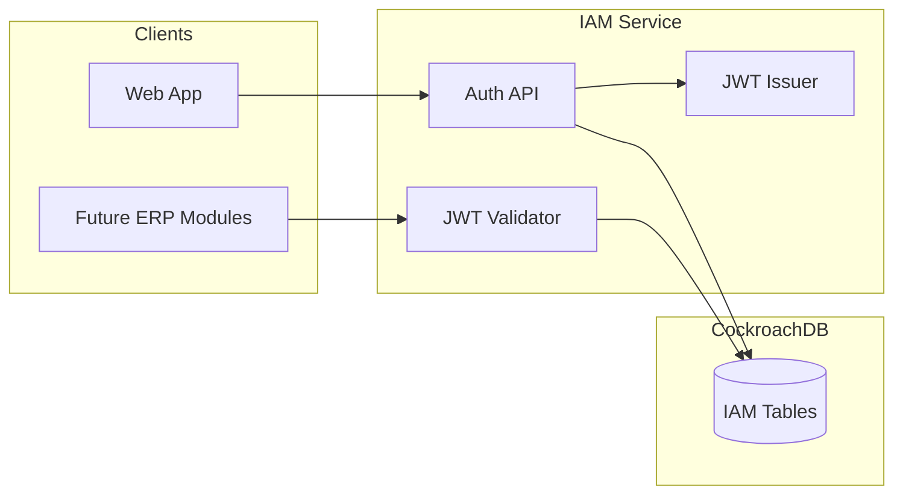

# Identity and Access Management for Multi-Tenant ERP (Updated)

## Scope and assumptions

- **Stack**: Application layer can be Node/TypeScript or Java; **database schema and JWT contract are stack-agnostic**.
- **Multi-tenancy**: Users can belong to **multiple tenants** via a **tenant_users** membership table; identity is global, membership and roles are per-tenant.
- **CockroachDB**: UUID primary keys; `tenant_id` in PKs or unique constraints where needed for tenant-scoped data.

---

## 1. High-level architecture

- **IAM**: Login (with tenant context), refresh, user/role CRUD, JWT issuance.
- **ERP modules**: Validate JWT and use `tenant_id` + `user_id` from token.
- **Users**: One global identity; **tenant_users** links them to tenants; roles/permissions are per tenant.

---

## 2. Database: CockroachDB table design

### 2.1 Core tables

| Table                | Purpose                                                                                                                                                                                                                                                                                    |
| -------------------- | ------------------------------------------------------------------------------------------------------------------------------------------------------------------------------------------------------------------------------------------------------------------------------------------ |
| **tenants**          | Organization. `id`, `name`, `slug` (unique), `status`, `created_at`, `updated_at`.                                                                                                                                                                                                         |
| **users**            | **Global** identity (one row per person). `id`, `email` (unique globally), `password_hash`, `display_name`, `status`, `email_verified_at`, `last_login_at`, `created_at`, `updated_at`. No `tenant_id`.                                                                                    |
| **tenant_users**     | **Membership**: which users belong to which tenants. `id`, `tenant_id`, `user_id`, optional `display_name` (override per tenant), `status` (per-tenant, e.g. active/invited), `invited_at`, `joined_at`, timestamps. **UNIQUE (tenant_id, user_id)**. Indexes: `(tenant_id)`, `(user_id)`. |
| **roles**            | Role definitions per tenant. `tenant_id`, `name` (unique per tenant), `description`, `is_system`, timestamps.                                                                                                                                                                              |
| **permissions**      | Global permission registry. `code` (unique), `description`, timestamps.                                                                                                                                                                                                                    |
| **role_permissions** | Role has permission (tenant-scoped). `tenant_id`, `role_id`, `permission_id`, unique `(tenant_id, role_id, permission_id)`.                                                                                                                                                                |
| **user_roles**       | User has role **in a tenant**. `tenant_id`, `user_id`, `role_id`, unique `(tenant_id, user_id, role_id)`. FK `user_id` → users; membership implied by `tenant_users` (user must exist in `tenant_users` for that tenant to assign roles).                                                  |

### 2.2 Optional

| Table              | Purpose                                                                                                                         |
| ------------------ | ------------------------------------------------------------------------------------------------------------------------------- |
| **refresh_tokens** | `tenant_id`, `user_id`, `jti`, `expires_at`, `created_at`. Index `(tenant_id, jti)`. Encodes “which tenant” the refresh is for. |
| **audit_log**      | `tenant_id`, `actor_id` (user_id), `action`, `resource_type`, `resource_id`, `payload` (JSONB), `created_at`.                   |

### 2.3 Model change: users vs tenant_users

- **users**: Single identity (email, password). One user can log in once and switch tenants via UI or login flow.
- **tenant_users**: “User X is a member of tenant Y.” Use for: listing members of a tenant, checking if user can access a tenant, storing per-tenant display name or status.
- **Login flow**: Request includes tenant identifier (e.g. tenant slug or id). Validate credentials against **users**; then verify (tenant_id, user_id) exists in **tenant_users** and status is active; then issue JWT with that `tenant_id` and `sub` = user_id.
- **user_roles**: Only assign roles for (tenant_id, user_id) pairs that exist in **tenant_users**.

### 2.4 CockroachDB notes

- All IDs: `UUID PRIMARY KEY DEFAULT gen_random_uuid()`.
- Uniques: `users(email)`; `tenant_users(tenant_id, user_id)`; `roles(tenant_id, name)`; etc.
- Indexes: `tenant_users(tenant_id)`, `tenant_users(user_id)`; `user_roles(tenant_id, user_id)`; `refresh_tokens(tenant_id, jti)`.

---

## 3. JWT design for ERP modules

- **Claims**: `sub` (user_id), `tenant_id` (current tenant for this session), `email`, `roles` (or role codes), optional `permissions`.
- **Flow**: Same as before; ERP modules validate JWT and enforce tenant isolation using `tenant_id` from the token. No change to JWKS or algorithm.

---

## 4. Implementation outline

### Phase 1: Foundation

- CockroachDB connection and migrations.
- **Migrations**: Create `tenants`, **users** (no tenant_id), **tenant_users**, `roles`, `permissions`, `role_permissions`, `user_roles`, `refresh_tokens`, optional `audit_log`.
- Seed: default permissions, one tenant, one user, one **tenant_users** row linking them, and optional admin role.

### Phase 2: IAM service

- **Login**: Accept tenant + email + password; validate against **users**; check **tenant_users** for (tenant_id, user_id) and status; issue JWT with that tenant_id and sub.
- **Tenant switching**: If desired, separate endpoint that accepts refresh token + target tenant_id; verify user is in **tenant_users** for that tenant; issue new access token with new tenant_id.
- User CRUD: Can remain global for “identity” (email/password) or be tenant-scoped in API (e.g. “users in this tenant” = list via **tenant_users**). Role/permission assignment stays tenant-scoped and applies only to (tenant_id, user_id) present in **tenant_users**.
- **tenant_users** CRUD: Invite user (by email) to tenant (create user if needed + tenant_users row); list members; update per-tenant status/display_name; remove membership.

### Phase 3: ERP modules

- Unchanged: validate JWT, use `tenant_id` and `sub` (user_id), enforce tenant isolation.

---

## 5. File and folder structure

Same as before; ensure migrations include **tenant_users** and **users** without tenant_id. Example migration order: `tenants` → `users` → `tenant_users` → `roles` → `permissions` → `role_permissions` → `user_roles` → `refresh_tokens` → `audit_log`.

---

## 6. Security and deliverables

- **Tenant isolation**: All tenant-scoped queries (including role/permission checks) must use `tenant_id` from the authenticated context; membership enforced via **tenant_users**.
- **Deliverables**: Versioned SQL migrations (including **tenant_users** and global **users**), IAM auth and tenant_users/membership APIs, JWT issuance and JWKS, documented JWT claims and middleware for ERP modules.

