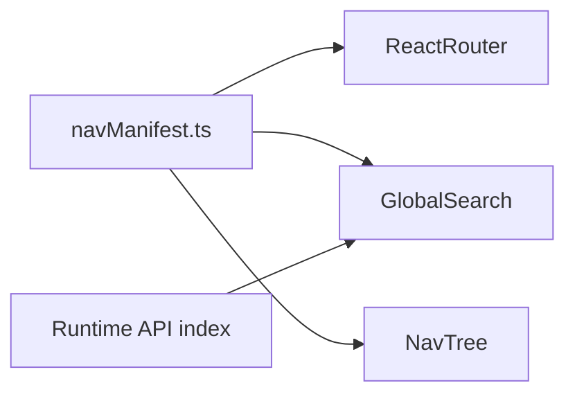

# Searchable routes and navigation tree

## Core idea

Treat **routing** and **navigation metadata** as related but not identical:

- **Router** answers: “What component renders for this URL?”
- **Nav manifest** answers: “What can the user discover? How is it labeled, grouped, and filtered?”

If route definitions and nav metadata live in one place (or the manifest **drives** route registration), you avoid drift when you add pages.

## 1. Navigation manifest shape

Define a small TypeScript model (new module, e.g. `[erp-portal/src/navigation/navManifest.ts](c:\project\ai\erp-portal\src\navigation\navManifest.ts)`):

- `**id**`: stable string (for keys, analytics).
- `**path**`: static path (e.g. `/entities`) or a **pattern** for display only (e.g. `/entities/:entityId/layouts`) — see dynamic routes below.
- `**title`**, optional `**subtitle` / `description`**.
- `**keywords**`: string array for search (synonyms, feature names).
- `**parentId**` (flat tree) **or** nested `children` — pick one style; flat + `parentId` is easy to filter/sort.
- `**requiresAuth`**: boolean (hide from tree when logged out, or show as disabled).
- `**permissions`** (optional): e.g. `entity_builder:schema:read` — filter items using JWT claims if you expose them to the client later.
- `**searchable**`: boolean — e.g. set `false` for pure param patterns that never render without IDs.

**Static entries** today would include: Login (maybe excluded from app chrome), Entities list, and optionally “patterns” for layout list / builder with clear copy: “Form layouts (open from an entity)” so search still helps even when the exact URL needs an ID.

## 2. Wiring to React Router

Two common patterns (either is fine):

**A. `useRoutes` from a generated route table**  
Build an array of `{ path, element }` (and `children` for nested layouts) from the same manifest or a parallel `routes.tsx` that imports the same `path` constants. Keeps URLs in one module.

**B. Keep `[App.tsx](c:\project\ai\erp-portal\src\App.tsx)` `<Routes>` but import path constants + elements from `routes.config.ts`** so manifest and `Route` paths cannot diverge.

Recommendation: **path constants** shared by manifest and `<Route path={...} />` (minimal change to current `[App.tsx](c:\project\ai\erp-portal\src\App.tsx)`).

## 3. Global search bar

**Index inputs:**

1. **Static slice**: all manifest entries with `searchable !== false`, scored by match on `title`, `keywords`, `path`, `description` (simple `toLowerCase().includes` or **Fuse.js** if you want fuzzy ranking later).
2. **Dynamic slice** (optional but powerful for ERP): after login, fetch **entities** (and optionally **layouts per entity** or a single “recent layouts” endpoint later) and map each row to a search result:
  - `title`: entity or layout name  
  - `path`: built URL, e.g. `/entities/${id}/layouts` or `.../layouts/${layoutId}`  
  - `keywords`: slug, id prefix

Merge and dedupe by `path`. Debounce API calls on query change if lists are large.

**UI:** dropdown or command palette (`Cmd+K`) listing grouped sections: “Navigation”, “Entities”, “Layouts”. Selecting an item `navigate(path)`.

**Auth:** only show protected targets when `accessToken` is set; respect `permissions` when you have claims on the client.

## 4. Navigation tree

- Build a **tree** from manifest: group by `parentId` or walk nested `children`.
- Render recursive component (e.g. `NavTree.tsx`): disclosure triangles, `NavLink` / `Link` for static paths.
- For **dynamic** children (entities), either:
  - **Lazy-expand**: clicking “Entities” loads entities and injects child nodes (same data as search), or
  - **Link only at leaf**: tree shows static structure; entity-specific nodes appear after expand.

Use `**NavLink`** with `end` prop where needed so active state matches nested routes.

## 5. Dynamic / parametric routes

Routes like `/entities/:entityId/layouts/:layoutId` are **not** fully known at build time. Options:

| Approach                                        | Search                                                   | Tree                                                  |
| ----------------------------------------------- | -------------------------------------------------------- | ----------------------------------------------------- |
| Manifest only describes **pattern** + help text | User finds “Form builder” and doc says “open via entity” | Tree shows placeholder or “Entities” subtree from API |
| **Runtime index** from APIs                     | Full titles and deep links                               | Expand entity → layouts                               |

Your product likely wants **runtime index** for entity/layout discovery; keep manifest for **app sections** and **static** pages.

## 6. Layout integration

Add an **app shell** (optional layout route) with:

- Top: global search
- Side or collapsible panel: nav tree
- Main: `<Outlet />`

Login route can **opt out** of the shell (full-page login), matching current behavior.

## 7. Practical rollout (phased)

1. **Phase 1**: `navManifest.ts` + path constants; `NavTree` + simple search over manifest only; optional shell.
2. **Phase 2**: merge **entity list** (and optionally layouts) into search + tree expand under “Entities”.
3. **Phase 3**: permissions on manifest entries; fuzzy search; `Cmd+K` command palette.

## 8. Pitfalls to avoid

- **Duplicating paths** in manifest vs `Route` — use shared constants.
- **Over-indexing** param-only routes without resolving IDs — users get broken links; prefer API-backed entries with real paths.
- **Very large trees** — virtualize or limit depth; lazy-load children.

This design stays compatible with your current `[App.tsx](c:\project\ai\erp-portal\src\App.tsx)` structure and scales as you add many modules (IAM admin, records, settings, etc.) by appending manifest entries and route constants.