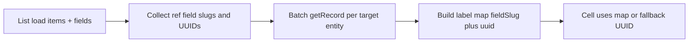

# Reference column labels on record list

## Current behavior

- `[EntityRecordsListPage.tsx](erp-portal/src/pages/EntityRecordsListPage.tsx)` renders reference cells via `formatCellValue`, which stringifies the stored UUID ([lines 85–91](erp-portal/src/pages/EntityRecordsListPage.tsx)).
- Form reference UI builds labels in `[ReferenceRecordLookupField.tsx](erp-portal/src/components/runtime/ReferenceRecordLookupField.tsx)` (`buildRecordDisplayLabel`, `resolveLabelFromRecord`, `dedupeSlugsPreserveOrder`) using `readReferenceFieldConfig` for `referenceLookupDisplaySlugs` and the target entity’s `defaultDisplayFieldSlug` ([lines 52–96](erp-portal/src/components/runtime/ReferenceRecordLookupField.tsx)).

## Approach

### A. Source-entity field flag (composite "Display" column)

Add a boolean on `**EntityField**` for the **entity being listed** (source/host), e.g. `includeInListSummaryDisplay` (final name to align with codebase naming).

- **Meaning**: this field is one part of the **default list row summary** shown in a **single** column when using the **basic** list layout (the existing "Display" column driven by `displayForRecord` today).
- **Multiple flags**: order parts by field `**sortOrder**` (then stable tie-break). For each part:
  - **Reference**: resolved label (same rules as below: `referenceLookupDisplaySlugs` → target `defaultDisplayFieldSlug` → first non-empty value).
  - **Other types**: same formatting as today (`formatCellValue` / boolean-friendly strings).
- **Join**: concatenate non-empty parts with a fixed separator (recommend `" - "` to match reference lookup joins in the form, or `·`—pick one and document).
- **Empty parts**: skip or show `—` for the whole cell only if every part is empty.
- **Fallback when no field has the flag**: keep current behavior: `displayForRecord` using entity-level `defaultDisplayFieldSlug` only ([lines 62–75](erp-portal/src/pages/EntityRecordsListPage.tsx)).

**Scope**: This replaces/enhances only the **basic** layout "Display" column. **Saved list views** keep explicit per-column field slugs; those reference columns still benefit from per-column UUID→label resolution (section B). Optionally later: add a list-view column type "Summary (flagged fields)" — out of scope unless you want parity in designer.

**Backend**: Flyway column on `entity_fields`, JPA entity, create/patch field endpoints, and portal `EntityFieldDto` + **Edit field** UI (checkbox + short help: "Include in record list summary (concatenated with other flagged fields in one Display column)").

### B. Reference columns (custom list view + resolution)

After each successful records load, resolve distinct referenced IDs for visible **reference** columns (and for **reference** fields that participate in the composite summary in A), fetch target rows with `getRecord(tenantId, targetEntityId, recordId)`, and pass a lookup map into cell renderers.

### 1. Shared label builder (single source of truth)

- Add `[erp-portal/src/utils/referenceRecordDisplayLabel.ts](erp-portal/src/utils/referenceRecordDisplayLabel.ts)` (name can vary) exporting:
  - `dedupeSlugsPreserveOrder` / `formatReferenceValueForLabel` (stringify like existing `formatCell`)
  - `buildReferenceRecordLabel(rec, targetEntityDefaultDisplaySlug, referenceLookupDisplaySlugs)`
- Refactor `[ReferenceRecordLookupField.tsx](erp-portal/src/components/runtime/ReferenceRecordLookupField.tsx)` to import these helpers so list and form stay aligned.

### 2. Entity metadata for targets

- In `[EntityRecordsListPage.tsx](erp-portal/src/pages/EntityRecordsListPage.tsx)`, load `**listEntities()**` once (or when `entityId` / tenant changes), same pattern as `[RecordFormPage.tsx](erp-portal/src/pages/RecordFormPage.tsx)`, to map `targetEntitySlug` (from `readReferenceFieldConfig`) → `EntityDto` (for `id` and `defaultDisplayFieldSlug`).
- If slug is missing or entity not found, fall back to short UUID or `—`.

### 3. Resolution effect

- Inputs: `tenantId`, `items`, `fields`, `visibleColSlugs` (custom layout) or equivalent visible reference fields, and `entitiesBySlug`.
- For each reference field in visible columns:
  - Read `raw = row.values[field.slug]`; if not `looksLikeRecordUuid`, skip or show as-is.
  - Dedupe keys: e.g. `targetEntityId + ':' + uuid` (and keep which **field** used which config for label building after fetch—group fetches by `targetEntityId`, then apply each field's `referenceLookupDisplaySlugs` when computing label).
- Fetch with bounded concurrency (reuse pattern from `[RelatedRecordsRegion.tsx](erp-portal/src/components/runtime/RelatedRecordsRegion.tsx)` `chunk` + `Promise.all`).
- Store in React state: `Map` or `Record<string, string>` keyed by `**fieldSlug::uuid**` so two reference fields to the same target can still use different lookup column configs.
- Clear map when `items` / view changes; tolerate errors per-row (leave UUID or `—`).

### 4. Cell rendering and inline edit

- Extend `formatCellValue` **or** the column `cell` branch (lines 218–268): when `field.fieldType === 'reference'` and not inline-editing, use resolved label from map; if still loading, show truncated UUID or `…`.
- **Inline edit**: today reference columns fall through to a `TextInput` ([lines 250–256](erp-portal/src/pages/EntityRecordsListPage.tsx)), which is already a poor fit. **Recommendation**: treat reference as **read-only in inline mode** for this iteration (show resolved label + no text input), or explicitly skip inline for `reference` and show label only—pick one and document in list designer help text if needed.

### 5. Sorting (explicit limitation)

- Keep initial behavior: `accessorFn` / `sortValueForField` for references remains UUID-based unless you add a second pass (enriched row data or label map–aware accessor). **Document** in code comment: display is friendly; column sort may still follow UUID order until a follow-up.

### 6. Permissions / PII

- `getRecord` already respects server-side rules; if label resolution fails (403/network), degrade gracefully.
- If target display uses PII fields and user lacks PII read, server may mask—acceptable.

### 7. Testing

- Unit test the shared `buildReferenceRecordLabel` (empty slugs → default display; slugs → joined string; nulls).
- Optional: small integration-style test with mocked `getRecord` for the list page hook if you extract resolution into a `useReferenceLabelsForList` hook.

## Backend optimization (optional): two round-trips vs one mega-query

Prefer **one service method** (e.g. in `[RecordsService](c:/project/ai/entity-builder/src/main/java/com/erp/entitybuilder/service/RecordsService.java)`) that:

1. **Round-trip 1 — existing path**: load the **page** of records (IDs + values) as today via `listRecords` / `queryRecords` (already paginated and Cockroach-friendly if pagination rules below are respected).
2. **Round-trip 2 — limited native query** (optional): given the **same page's `record_id` list** plus entity metadata (flagged summary fields, reference targets), run a **narrow** SQL via `JdbcTemplate` or `@Query(nativeQuery = true)` that either:
  - returns `**(record_id, summary_text)**` for scalar-only concatenation (join `entity_fields` + `entity_record_values`, `string_agg` / ordered concat), and/or
  - returns **distinct `(target_entity_id, referenced_record_id)`** pairs to hydrate labels in Java **without** N per-row `getRecord` HTTP calls from the portal.

This avoids a **single dynamic mega-query** that tries to inline every reference join variant in SQL. Two DB round-trips in one transaction is often **acceptable** operationally and **easier to maintain** than one generated statement for all entity shapes.

**When to keep portal-only batching:** If backend work slips, the portal can still batch `getRecord` for the **current page only** (bounded N)—already aligned with list pagination.

## Pagination: Cockroach-compatible

Entity-builder already targets Cockroach (`[EntityRecordRepository](c:/project/ai/entity-builder/src/main/java/com/erp/entitybuilder/repository/EntityRecordRepository.java)`, dialect RC). Any new list/summary SQL must follow the same patterns as existing list/count:

- **v1 (simplest)**: `**LIMIT` + `OFFSET`** `(pageSize)` and `(page - 1) * pageSize` — valid on Cockroach, same semantics as current list endpoints. Accept that **large OFFSET** degrades (full scan of skipped rows); OK for moderate pages.
- **v2 (scale-up)**: **Keyset (seek) pagination** — `WHERE (sort_col, id) > ($lastSort, $lastId) ORDER BY sort_col, id LIMIT $n` (or tie-break with primary key). Avoids expensive offsets on deep pages; document stable sort columns.
- **Avoid**: relying on ambiguous `ORDER BY` without tie-break (non-deterministic pages under concurrency).
- **Transactions**: keep summary query **read-only** in the same RC / isolation assumptions as existing read paths; no new locking requirement for list UI.

Wire API contract so the portal passes **page + pageSize** unchanged; any second query uses **only IDs from the page** returned by round-trip 1 so summary work stays **O(page size)**.

## Optional later scale-up

- Merge round-trips into one SQL only if profiling proves necessary; prefer **materialized** `display_summary` on write before heroic single-query generators.

