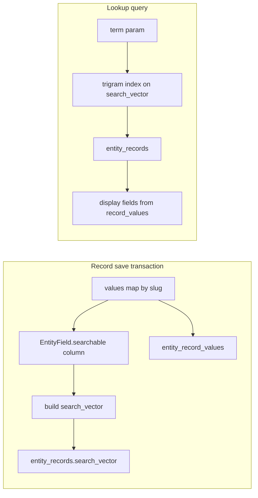

# Single Search Vector (concatenation) — implementation plan

## Reality check vs your spec

| Spec assumption                             | This codebase today                                                                                                                                                                                                                                                                                                                                                           |
| ------------------------------------------- | ----------------------------------------------------------------------------------------------------------------------------------------------------------------------------------------------------------------------------------------------------------------------------------------------------------------------------------------------------------------------------- |
| JSON `payload` on `entity_records`          | Values live in `[entity_record_values](c:\project\ai\entity-builder\src\main\resources\db\migration\V1__create_dynamic_entities.sql)` (`value_text`, `value_number`, `value_date`, `value_boolean`, `value_reference`) keyed by `field_id`.                                                                                                                                   |
| `entity_def_id` / slug `sys_customer`       | Entities are UUIDs; API paths use `[/v1/tenants/{tenantId}/entities/{entityId}/...](c:\project\ai\entity-builder\src\main\java\com\erp\entitybuilder\web\v1\RecordsController.java)`. Lookup should use `**entityId` (UUID)** + `term` (and optional layout overrides), not a separate string catalog id, unless you add a separate `entity_key` column later.                |
| Postgres `GIN (search_vector gin_trgm_ops)` | CockroachDB supports **trigram indexes** for `LIKE`/`ILIKE` acceleration ([trigram indexes docs](https://www.cockroachlabs.com/docs/stable/trigram-indexes)). Use **Flyway** syntax validated against your CRDB version (often `CREATE INDEX ... USING GIN (search_vector gin_trgm_ops)` or the documented `INVERTED INDEX` variant — verify in a one-off migration dry-run). |

The design still holds: **one column, one index family, no per-field DDL** when admins toggle searchability.

---

## 1. Metadata: searchable flag on `EntityField`

- **Primary storage (required):** Add an explicit boolean on the field model and database:
  - **Flyway:** `ALTER TABLE entity_fields ADD COLUMN searchable BOOLEAN NOT NULL DEFAULT false` (same migration family as `search_vector`, or adjacent version).
  - **JPA:** Add `searchable` (or `isSearchable` mapped to column `searchable`) on `[EntityField](c:\project\ai\entity-builder\src\main\java\com\erp\entitybuilder\domain\EntityField.java)`.
  - **Service + API:** Extend `[EntitySchemaService](c:\project\ai\entity-builder\src\main\java\com\erp\entitybuilder\service\EntitySchemaService.java)` create/update field methods; `[EntityFieldDtos](c:\project\ai\entity-builder\src\main\java\com\erp\entitybuilder\web\v1\dto\EntityFieldDtos.java)` **CreateFieldRequest** / **UpdateFieldRequest** / **EntityFieldDto** with `searchable`; `[EntityFieldsController](c:\project\ai\entity-builder\src\main\java\com\erp\entitybuilder\web\v1\EntityFieldsController.java)` pass it through.
- **Record vector build:** `[RecordsService](c:\project\ai\entity-builder\src\main\java\com\erp\entitybuilder\service\RecordsService.java)` includes a field’s value in `search_vector` **iff** `EntityField.isSearchable()` is true (see §3)—no need to parse `config` for this decision.
- **Tenant extension fields:** If extension entity fields are mirrored in `tenant_entity_extension_fields`, add matching **`searchable`** column + `[TenantEntityExtensionField](c:\project\ai\entity-builder\src\main\java\com\erp\entitybuilder\domain\TenantEntityExtensionField.java)` + mirror logic in `[EntitySchemaService](c:\project\ai\entity-builder\src\main\java\com\erp\entitybuilder\service\EntitySchemaService.java)` so extension fields behave the same.
- **Optional:** Keep `**entity_fields.config**` in sync for tooling (e.g. `isSearchable` in JSON) **only** if you want dual representation; otherwise **source of truth** is the `searchable` column.

**PII policy (recommend):** If `pii == true`, **ignore `searchable`** when building `search_vector` (treat as false) or reject `searchable=true` on write; document in README.

---

## 2. Physical schema

- **Flyway** (e.g. `V6__entity_records_search_vector.sql` in `[entity-builder/src/main/resources/db/migration](c:\project\ai\entity-builder\src\main\resources\db\migration)`):
  - `ALTER TABLE entity_fields ADD COLUMN searchable BOOLEAN NOT NULL DEFAULT false` (and on `tenant_entity_extension_fields` if mirroring extension fields).
  - `ALTER TABLE entity_records ADD COLUMN search_vector STRING` (or `VARCHAR` with a sensible max, e.g. 8–32 KiB, enforced in app).
  - Default existing rows to `''` or `NULL` and **backfill** in app on next save, or one-off `UPDATE` to empty string.
  - **Trigram index** on `(tenant_id, entity_id, search_vector)` or at least `search_vector` — narrow by `tenant_id` + `entity_id` in every query so the index is selective; composite + trigram strategy per CRDB docs.
- **JPA:** Add `searchVector` to `[EntityRecord](c:\project\ai\entity-builder\src\main\java\com\erp\entitybuilder\domain\EntityRecord.java)` (insertable/updatable; not exposed in normal record JSON if you want to keep responses lean).

---

## 3. Pre-save / post-save: build `search_vector` in the same transaction

Implement in `[RecordsService](c:\project\ai\entity-builder\src\main\java\com\erp\entitybuilder\service\RecordsService.java)` (single transactional path for create + update):

1. Load `List<EntityField>` for `entityId` (already done for validation).
2. Filter fields where **`EntityField` is searchable** (`searchable == true`, subject to PII policy in §1).
3. For each such field, resolve value from the **incoming** `values` map (create/patch) merged with **existing** `EntityRecordValue` for PATCH (so unchanged searchable fields still contribute).
4. Normalize to text: stringify numbers/dates/booleans/UUID references consistently (e.g. ISO dates, plain decimal string); trim; lowercase entire concatenation; join with spaces; collapse repeated spaces.
5. Truncate to column max length.
6. Set `record.setSearchVector(...)` before `save` / flush.

Call this from the same `@Transactional` methods that persist `entity_record_values` so **atomicity** matches your “masterstroke” requirement.

**When schema changes:** If an admin toggles **`searchable`** on a field, existing `search_vector` rows are stale until each record is updated. **Phase 2 (optional):** async job or `PATCH` entity to “reindex” all records for that entity; not required for v1 if documented.

---

## 4. Lookup API

- **Endpoint (aligned with existing style):**  
`GET /v1/tenants/{tenantId}/entities/{entityId}/records/lookup?term=...&limit=20`  
Same auth as records: `[RecordsController](c:\project\ai\entity-builder\src\main\java\com\erp\entitybuilder\web\v1\RecordsController.java)` + `@PreAuthorize` + tenant check.
- **Behavior:**
  - Require minimum `term` length (e.g. 2–3) or return 400 to avoid useless wide scans.
  - Query: `WHERE tenant_id = ? AND entity_id = ? AND search_vector ILIKE '%' || escape(term) || '%'` (proper escape for `%`/`_`) **LIMIT** n.
  - Response: `{ "items": [ { "recordId", "displayLabel", "values": { "slug": ... } } ] }`  
    - `**displayLabel`:** built from entity `default_display_field_slug` (see below) or first searchable field, until form override exists.
    - `**values`:** map of slug → scalar for only the slugs needed to render a future template on the client (or server-render `displayLabel` using template).
- **Repository:** Prefer Spring Data `@Query` native or `JdbcTemplate` for ILIKE + LIMIT if JPA is awkward; ensure index use (explain in dev).
- **Gateway:** Add route in `[api-gateway/.../application.yml](c:\project\ai\api-gateway\src\main\resources\application.yml)` for the new path pattern if not already covered by `.../records/`**.

---

## 5. Date, numeric, and structured range queries (not `search_vector`)

`search_vector` is for **substring / typeahead text** (trigram + `ILIKE`). It is **not** the right primitive for **date intervals**, numeric thresholds, or boolean filters.

### 5.1 Where range semantics live

Dates and numbers are already stored in typed columns on **`entity_record_values`**: `value_date`, `value_number`, etc., keyed by `field_id` (see V1 migration). Use those for:

- **Date range:** `value_date >= ? AND value_date < ?` (prefer half-open ranges).
- **Numeric range:** comparisons on `value_number`.
- **Join path:** `entity_records` → `entity_record_values` → `entity_fields` (filter by `entity_id`, tenant, and field slug or `field_id`, and `field_type` where needed).

Add **B-tree-friendly indexes** tuned to the query shape, e.g. composite `(field_id, value_date)` or patterns that include `record_id` if you always resolve by record first. Scope every list query by `tenant_id` and `entity_id` (via `entity_records`) so scans stay bounded.

### 5.2 Interaction with `search_vector`

You may still **append ISO-normalized date strings** (or locale text) into `search_vector` so a user typing “2025-03” gets hits—that is **text matching**, not a calendar range. For “invoices due between March 1 and March 31,” use **`value_date`** filters, not the concatenated string.

**Product pattern:** Expose **both** on list/search endpoints when needed, e.g. `term=acme` **and** `dueDateFrom=…&dueDateTo=…` (names illustrative). Lookup-only flows can stay `term`-only on `search_vector`.

### 5.3 Separate table “just for dates” (usually skip)

A second denormalized table holding only dates (e.g. `(record_id, field_id, value_date)`) is **largely redundant** with the date rows already in `entity_record_values`: same information, extra sync and failure modes.

- **Do not** rely on a second “date text blob” per record for range queries; text blobs do not give clean range semantics.
- **Consider** a narrow side table or materialized projection only if profiling shows `entity_record_values` is too wide or hot paths need a covering index that is hard to express on the main table—still usually fixable with indexes on `value_date` first.
- **Rollups** (e.g. one row per record with `min`/`max` date across selected fields) are a different use case—aggregation for reporting, not a substitute for per-field range filters.

### 5.4 Implementation note (phase 2)

The existing paginated **record list** API can be extended later with optional structured filters (per-field slug + operator + value). That work is **orthogonal** to `search_vector` and should be specified in the same transaction semantics: optional `term` on `search_vector` **AND** optional predicates on joined `entity_record_values`.

---

## 6. Default display field (relational / global default)

- **Flyway:** `ALTER TABLE entities ADD COLUMN default_display_field_slug VARCHAR(100) NULL` (FK not needed; validate slug exists in app on write).
- **API:** Extend `[EntityDtos](c:\project\ai\entity-builder\src\main\java\com\erp\entitybuilder\web\v1\dto\EntityDtos.java)` + `[EntitiesController](c:\project\ai\entity-builder\src\main\java\com\erp\entitybuilder\web\v1\EntitiesController.java)` PATCH/GET to read/write `defaultDisplayFieldSlug`.
- **EntitySchemaService:** validate slug exists on that entity’s fields when set.

---

## 6. Form layout: contextual override (ReferenceLookup)

- **Layout JSON:** Extend `[LayoutItem](c:\project\ai\erp-portal\src\types\formLayout.ts)` (and `[FormLayoutJsonValidator](c:\project\ai\entity-builder\src\main\java\com\erp\entitybuilder\service\FormLayoutJsonValidator.java)` if it validates item shape) with an optional block, e.g.  
`referenceLookup?: { targetEntityId: string; displayTemplate?: string; searchFieldSlugs?: string[] }`  
Use **UUID** `targetEntityId` to match APIs; UI can resolve labels from entity list.
- **Lookup execution:** Portal (or future runtime) calls lookup with `entityId = targetEntityId`; passes `displayTemplate` + `searchFieldSlugs` only as **client-side** rendering hints, **or** add optional query params `displaySlugs=a,b,c` so the API returns those value keys (bounded list, max N slugs).
- **Docs:** Update `[design/Entity_Form_Builder_UI.md](c:\project\ai\design\Entity_Form_Builder_UI.md)` and entity-builder README with the contract.

---

## 8. UI (erp-portal) — minimal slice

- Field create/edit: checkbox bound to **`searchable`** on the field API (`EntityFieldDto` / create & patch field requests).
- Entity settings (optional): default display field slug dropdown.
- Reference control (later): component that debounces input and calls lookup API; renders `displayLabel` or template from returned `values`.

Prioritize **API + search_vector + lookup** first; portal can follow in a second PR.

---

## 9. Testing

- **Unit:** Search vector builder — mixed types, empty searchable set, PATCH merge, PII excluded, truncation.
- **E2E** (pattern from `[TenantEntityExtensionsE2ETest](c:\project\ai\entity-builder\src\test\java\com\erp\entitybuilder\e2e\TenantEntityExtensionsE2ETest.java)`): create entity → fields with **`searchable: true`** → create record → JDBC or GET assert `search_vector` content → GET lookup with `term` returns row → update record changes vector.

---

## 10. Risks / follow-ups

- **ILIKE `%term%` + trigram:** Validate index usage on your CRDB version; adjust index definition if plans show sequential scan.
- **Scale:** Very long concatenations hurt row width; cap length and number of searchable fields per entity in app config if needed.
- **Reindex** after bulk metadata changes (optional job).
- **Structured filters:** Date/number range listing is a separate path from `search_vector` (see §5); add list API filters in a follow-up if product needs combined `term` + range in one query.

